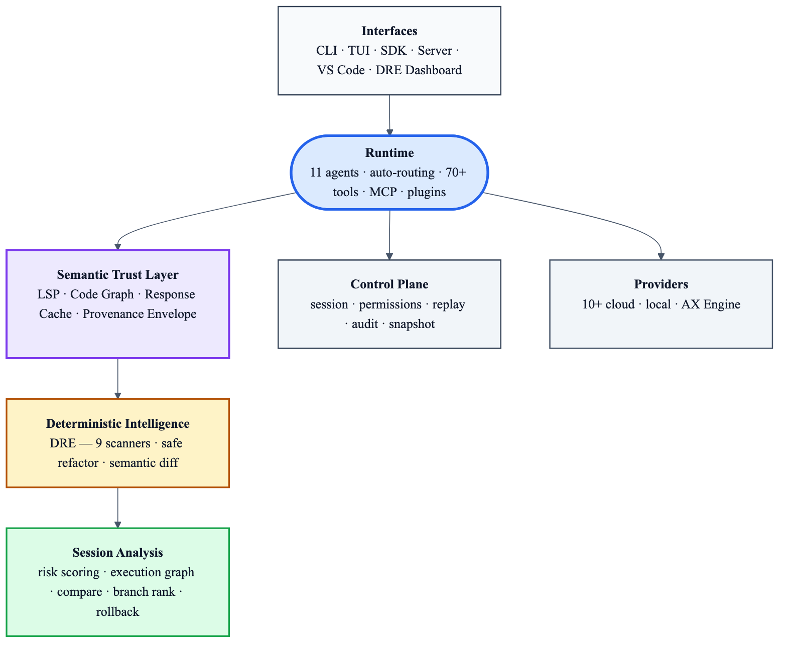

```
___________  __     _________________________________
___    |_  |/ /     __  ____/_  __ \__  __ \__  ____/
__  /| |_    /_______  /    _  / / /_  / / /_  __/
_  ___ |    |_/_____/ /___  / /_/ /_  /_/ /_  /___
/_/  |_/_/|_|       \____/  \____/ /_____/ /_____/
```

**AI coding runtime for teams that need control, auditability, and extensibility, not just code suggestions.**

AX Code is an AI execution system for software development. It combines agent routing, planning, tool orchestration, provider abstraction, session state, and sandboxed execution into one runtime that can run in the terminal, through an SDK, or inside your internal platform.

- **Controlled execution** through explicit tools, permissions, and sandbox modes
- **Provider-agnostic runtime** across cloud, local, and air-gapped model backends
- **Session-backed workflows** with persistence, replayable state, and memory
- **Extensible surface** through SDK, MCP, plugins, and headless server mode
- **Enterprise-ready posture** with localhost defaults, encryption at rest, and audit-friendly runtime structure

Built by [DEFAI Digital](https://github.com/defai-digital).

[](https://github.com/defai-digital/ax-code/actions/workflows/ax-code-ci.yml)
[](https://discord.gg/cTavsMgu)
[](LICENSE)

## Why AI Coding Breaks Down

AI coding becomes hard to trust when execution is opaque, unsafe, and difficult to reproduce in real environments.

- **Opaque execution** makes it hard to understand what the agent actually did
- **Unbounded tool access** makes real repositories and production-adjacent systems risky
- **Ephemeral workflows** make it difficult to resume, audit, or operationalize coding work across teams

AX Code addresses that with explicit tools, session-backed workflows, sandboxed execution, and a runtime designed for controlled automation instead of unstructured chat alone.

## What AX Code Is

Most AI coding products stop at chat plus tool calls. AX Code is designed as a runtime layer for coding workflows. It is more than a coding assistant: it is a controlled execution runtime for software development.

- **More controllable than chat-first coding tools.** Tool use is explicit, permissioned, and sandbox-aware.
- **More composable than a single CLI.** The same runtime can back the TUI, the SDK, headless automation, MCP-connected workflows, and internal developer platforms.
- **More deployable than cloud-only coding assistants.** It can run against hosted providers, local inference, or broader sovereign infrastructure.
- **More operationally useful for teams.** Sessions, storage, policy boundaries, and provider abstraction are built into the core runtime rather than bolted on later.

## Why Teams Choose AX Code

Teams adopt `ax-code` when they need AI coding to behave like an execution system they can reason about, integrate, and operate, rather than a suggestion layer they can only observe after the fact.

| Requirement                                      | Cursor / Claude Code / Copilot / Aider | AX Code                                                            |
| ------------------------------------------------ | -------------------------------------- | ------------------------------------------------------------------ |
| Multi-provider without workflow changes          | Mostly vendor-tied (one primary model) | Provider-agnostic (10+ cloud + local/AX Engine/Ollama)             |
| Controlled/safe tool execution                   | Often implicit or broad permissions    | Explicit tools, sandbox modes, permission rules, bash analysis     |
| **Semantic provenance & replay**                 | —                                      | **Every AI-consumed semantic answer carries source / completeness / timestamp, is cached content-addressably, and is recorded in a replayable audit trail** |
| Reusable across surfaces (CLI, IDE, SDK, CI)     | UI-bound or chat-only                  | Same runtime powers TUI, VS Code, headless server, full SDK        |
| Local-first / air-gapped / enterprise governance | Heavy cloud reliance                   | Local defaults, encrypted keys, session audit, deterministic DRE   |
| Extensibility & integration                      | Limited plugins                        | SDK, MCP servers, plugins, semantic trust layer, deterministic refactor tools |

## Primary Users

### Primary

- **Advanced developers** who want more control than suggestion-only coding tools
- **Platform and infrastructure teams** building internal coding agents, CI workflows, or developer platforms
- **AI-native engineering teams** that need provider flexibility, automation, and governed execution

### Secondary

- **General developers** who want a stronger local and multi-provider alternative to cloud-tied coding assistants

---

## Runtime Architecture

This is the product runtime itself, independent of the broader ecosystem:

<p align="center">
  
</p>

Source: [docs/ax-code-runtime.mmd](docs/ax-code-runtime.mmd)

The important distinction is that `ax-code` is not just a chat UI. It is a runtime that coordinates:

- interfaces such as CLI, TUI, SDK, ACP, and headless server mode
- agent routing, planning, and dependency-ordered execution
- tool execution, MCP integrations, a semantic trust layer (v2.22) with provenance envelopes + content-addressable cache + audit/replay, and a persistent code graph (Code Intelligence, v2.2) backed by language servers
- the **Debugging & Refactoring Engine** (DRE, v2.3+) — deterministic-first root-cause analysis, proactive scanners (race conditions, resource leaks, security patterns, hardcoded values), change-impact analysis, and shadow-worktree-validated refactors
- **incremental indexing** (v2.4) — content-hash skip on unchanged files, orphan purge on deleted files, per-file progress reporting
- session, memory, and storage state with replay, audit, and snapshot trails
- sandbox, permission, and policy boundaries
- provider abstraction across hosted and local inference

## High-Value Use Cases

1. **Large-codebase refactoring** — e.g. migrate legacy monolith, extract services, update frameworks using DRE (impact_analyze + refactor_apply), persistent sessions, and the semantic code graph
2. **Internal coding agents & CI** — embed via SDK/headless server for automated reviews, security scans, or PR bots
3. **Secure/auditable workflows** — sandbox + permission rules + encrypted sessions for enterprise or regulated environments
4. **Offline/air-gapped dev** — run fully local with AX Engine/Ollama, no code leaves machine

## When To Use AX Code

- You need AI to modify large codebases without giving it unrestricted execution
- You need coding workflows that can be resumed, reviewed, and operationalized across sessions
- You want AI agents inside internal platforms, CI pipelines, or enterprise development environments
- You need clear control over files, tools, permissions, network access, and model providers

## The AutomatosX Ecosystem

AX Code is the coding surface of a vertically integrated sovereign AI platform:

<p align="center">
  
</p>

Source: [docs/automatosx-stack.mmd](docs/automatosx-stack.mmd)

Within AutomatosX, `ax-code` is the developer-facing execution layer. `AX Engine` handles inference, `AX Serving` handles orchestration, `AX Fabric` handles knowledge, and `AX Trust` provides governance and policy boundaries.

| Component      | Repository                                                              | Role                                                                    |
| -------------- | ----------------------------------------------------------------------- | ----------------------------------------------------------------------- |
| **AX Studio**  | [defai-digital/ax-studio](https://github.com/defai-digital/ax-studio)   | General GenAI workspace — enterprise knowledge + agentic workflows      |
| **AX Code**    | [defai-digital/ax-code](https://github.com/defai-digital/ax-code)       | AI coding & automation — developer-optimized entrypoint                 |
| **AX Trust**   | —                                                                       | Deterministic AI pipeline — contract-based execution, guardrails, audit |
| **AX Serving** | [defai-digital/ax-serving](https://github.com/defai-digital/ax-serving) | Enterprise orchestration — multi-node routing, heterogeneous compute    |
| **AX Fabric**  | [defai-digital/ax-fabric](https://github.com/defai-digital/ax-fabric)   | Knowledge infrastructure — RAG, distillation, knowledge lifecycle       |
| **AX Engine**  | [defai-digital/ax-engine](https://github.com/defai-digital/ax-engine)   | Mac-native inference — Apple Silicon optimized, 30B-70B+ models         |

---

## Get Started in 60 Seconds

### Install

```bash
# macOS / Linux (Homebrew) — recommended
brew install defai-digital/ax-code/ax-code

# npm (any platform)
npm i -g @defai.digital/ax-code

# curl (Linux / macOS)
curl -fsSL https://github.com/defai-digital/ax-code/releases/latest/download/ax-code-$(uname -s | tr '[:upper:]' '[:lower:]')-$(uname -m | sed 's/aarch64/arm64/;s/x86_64/x64/').tar.gz | tar -xz -C /usr/local/bin
```

### Update

```bash
# Homebrew
brew upgrade ax-code

# npm
npm update -g @defai.digital/ax-code

# Built-in (any method)
ax-code upgrade
```

### Uninstall

```bash
# Homebrew
brew uninstall ax-code && brew untap defai-digital/ax-code

# npm
npm uninstall -g @defai.digital/ax-code

# Built-in
ax-code uninstall
```

### From Source (contributors)

```bash
git clone https://github.com/defai-digital/ax-code.git
cd ax-code && pnpm install && pnpm run setup:cli
```

Requires [pnpm](https://pnpm.io) v9.15.9+ and [Bun](https://bun.sh) v1.3.11+

### Run

```bash
# Set any provider key (pick one)
export GOOGLE_GENERATIVE_AI_API_KEY="your-key"   # Gemini
export XAI_API_KEY="your-key"                     # Grok
export GROQ_API_KEY="your-key"                    # Groq (free tier)

# Launch
ax-code
```

---

## Supported Providers

### Cloud

| Provider           | Models                          | Setup                          |
| ------------------ | ------------------------------- | ------------------------------ |
| **Anthropic**      | Claude Opus, Sonnet, Haiku      | `ANTHROPIC_API_KEY`            |
| **OpenAI**         | GPT-5, GPT-4, o3, o4            | `OPENAI_API_KEY`               |
| **Google**         | Gemini 3.0, 3.1                 | `GOOGLE_GENERATIVE_AI_API_KEY` |
| **xAI**            | Grok-2, Grok-3, Grok-4          | `XAI_API_KEY`                  |
| **DeepSeek**       | Chat, Reasoner                  | `DEEPSEEK_API_KEY`             |
| **Groq**           | Llama, Qwen, Gemma, DeepSeek    | `GROQ_API_KEY` (free)          |
| **GitHub Copilot** | Claude, GPT, Gemini via Copilot | `ax-code providers login`      |
| **Alibaba Cloud**  | Qwen3, Qwen3-Coder              | `DASHSCOPE_API_KEY`            |
| **Azure**          | GPT, Claude, Llama, Phi         | `AZURE_API_KEY`                |
| **Perplexity**     | Sonar, Sonar Pro, Deep Research | `PERPLEXITY_API_KEY`           |
| **Z.AI**           | GLM-4.5, GLM-4.7, GLM-5         | `ax-code providers login`      |

### Local / Sovereign (Offline, Air-Gapped)

| Provider      | Setup                                                                                                                          |
| ------------- | ------------------------------------------------------------------------------------------------------------------------------ |
| **AX Engine** | Apple Silicon optimized inference — [defai-digital/ax-engine](https://github.com/defai-digital/ax-engine)                      |
| **AX Studio** | Auto-detected at `localhost:11434` or `AX_STUDIO_HOST` — [defai-digital/ax-studio](https://github.com/defai-digital/ax-studio) |
| **Ollama**    | Auto-detected at `localhost:11434` or `OLLAMA_HOST`                                                                            |
| **LM Studio** | Configure in `ax-code.json`                                                                                                    |

Local providers auto-discover running models — no API key needed. Your code never leaves your machine.

---

## Core Features

### Specialized AI Agents

AX Code uses **10 purpose-built agents** with enterprise-focused roles (structured workflows, TDD/PRD/ADR enforcement, DRE tools for safe deterministic changes, prioritization, and high-value patterns). This differentiates us from general AI coders by supporting real business environments — governed processes, infra/DevOps, auditable refactoring, and quality gates instead of unstructured chat.

| Agent          | What It Does                                                            | Auto-routes When You Say...                        |
| -------------- | ----------------------------------------------------------------------- | -------------------------------------------------- |
| **Dev**        | General development with full tools (default)                           | _(default agent)_                                  |
| **Security**   | Vulnerability/secret scanning, OWASP, compliance (read-only + DRE)      | "scan", "security audit", "vulnerabilities"        |
| **Architect**  | Design analysis, dependencies, coupling (read-only)                     | "architecture", "review structure"                 |
| **Debugger**   | Root cause analysis, reproduction, systematic fixes (plan + DRE)        | "debug", "why is it crashing", "fix bug"           |
| **Perf**       | Bottlenecks, profiling, optimization (web-enabled + DRE)                | "slow", "optimize", "performance"                  |
| **DevOps**     | Infra, CI/CD, Docker, K8s, Terraform, deployments (write-enabled + DRE) | "deploy", "docker", "kubernetes", "ci/cd", "infra" |
| **Planner**    | Task decomposition and planning (read-only)                             | _(manual via Tab)_                                 |
| **Reasoner**   | Structured ReAct reasoning for complex tasks                            | _(manual via Tab)_                                 |
| **Assistant**  | Parallel multi-step execution (subagent)                                | _(subagent)_                                       |
| **Researcher** | Fast codebase exploration and search (subagent)                         | _(subagent)_                                       |

**Auto-routing** selects based on keywords/patterns with confidence scoring. Switch manually with **Tab**. All agents enforce enterprise best practices (TDD, PRD/ADR before features, DRE tools, prioritization). See `src/agent/agent.ts` for details.

### Semantic Trust Layer

AX Code treats every AI-consumed semantic answer — "what does this symbol refer to", "where is it used", "what calls this function" — as something that must be **traceable, reusable, and replayable**. Not just "correct today"; traceable **to a specific source**, at a **specific point in time**, with explicit **completeness**.

This is the control plane that backs AI coding workflows that teams can operationalize, not just observe.

**Provenance envelope.** Every AI-facing semantic result carries:
- `source` — `lsp` (freshly fetched) or `cache` (served from the response cache)
- `completeness` — `full` (every server participated), `partial` (some failed), or `empty` (no server matched)
- `timestamp` — when the underlying query was resolved
- `serverIDs` — which language servers contributed
- `cacheKey` — stable reference to the cached row when applicable

AI consumers no longer see "a list of symbols". They see **a list of symbols plus why the runtime trusts them**.

**Content-addressable response cache.** `references` and `documentSymbol` queries are cached against a SHA of the file content. A cache row is only reachable while the file bytes still match — stale rows are **unreachable by construction**, not expired by a watcher. In the reference benchmark this dropped `lsp.references` wall-clock by **~49%** and cut the sum of per-call RPC time by **~48%**. Feature-flagged behind `AX_CODE_LSP_CACHE=1` while the mechanism settles.

**Replayable audit trail.** Every semantic call routed through the `lsp` tool writes one row to `audit_semantic_call`: tool, operation, args, the returned envelope, and an error code on failure. Default writer is queue-by-default (tick-boundary flush + process-exit drain); `AX_CODE_AUDIT_SYNC=1` opts into synchronous writes for compliance scenarios. `ax-code debug replay <audit_id>` re-executes a recorded call and diffs the decision-path fields (`source`, `completeness`, `cacheKey`) against the recorded envelope — decision-path equivalence, not semantic-output determinism (external language servers are not deterministic, and the trust layer honestly scopes its claims there).

**Backed by real language servers.** TypeScript, Python (Pyright), Go (gopls), Rust (rust-analyzer), Ruby (Solargraph), C/C++ (clangd), and more — the same ones your IDE uses — surface through the envelope variants `LSP.referencesEnvelope`, `LSP.documentSymbolEnvelope`, `LSP.hoverEnvelope`, `LSP.definitionEnvelope`, `LSP.workspaceSymbolEnvelope`. Bare-array wrappers remain for back-compat.

### Code Intelligence Graph

AX Code builds a persistent code graph from semantic data — symbols, call edges, and cross-file references stored in SQLite for instant queries.

```bash
ax-code index                # Populate the code intelligence graph
ax-code index --concurrency 8  # Parallel indexing for large projects
```

**Incremental by default (v2.4).** Second runs skip unchanged files via content-hash matching — only modified files re-index. Deleted files are automatically purged from the graph. Progress shows per-file completion in real time.

The graph powers tools like `code-intelligence` (symbol lookup, callers, callees), `impact_analyze` (change impact estimation), and `refactor_plan` (dependency-aware refactoring).

### 38+ Built-in Tools

| Category              | Tools                                                               |
| --------------------- | ------------------------------------------------------------------- |
| **File operations**   | read, write, edit, glob, ls, multiedit, apply_patch                 |
| **Code search**       | grep (regex), codesearch (web), websearch                           |
| **Shell execution**   | bash (with timeout and sandboxing)                                  |
| **Semantic queries**  | definition, references, hover, symbols, call hierarchy, diagnostics (all envelope-wrapped) |
| **Code intelligence** | code-intelligence (graph queries, symbol lookup, call graphs)       |
| **DRE analysis**      | debug_analyze, dedup_scan, hardcode_scan, impact_analyze            |
| **DRE scanners**      | race_scan, lifecycle_scan, security_scan (proactive, incremental)   |
| **DRE refactoring**   | refactor_plan, refactor_apply (shadow-worktree-validated)           |
| **Planning**          | task, todo, plan enter/exit, skill                                  |
| **Web**               | webfetch (URL to markdown), websearch, exa-fetch                    |
| **Batch**             | Parallel tool execution                                             |

### Session Persistence

Every conversation is stored in SQLite. You can:

- **Resume** any previous session
- **Fork** a session to explore different approaches
- **Compact** sessions to reduce token usage
- **Export/Import** sessions as JSON

### MCP (Model Context Protocol)

Connect to external tools and services via MCP with 16 pre-configured templates:

| Category            | Servers                        |
| ------------------- | ------------------------------ |
| **Search & Web**    | Exa, Brave Search              |
| **Developer Tools** | GitHub, GitLab, Linear, Sentry |
| **Databases**       | PostgreSQL, SQLite             |
| **Browser**         | Puppeteer, Playwright          |
| **Cloud**           | Vercel, Cloudflare             |
| **Design**          | Figma                          |
| **Communication**   | Slack                          |

```bash
ax-code mcp add              # Add from template or custom
ax-code mcp list --discover  # Auto-detect available servers
```

Supports SSE, HTTP, and stdio transports with OAuth authentication.

### AGENTS.md Context System

Generate AI-optimized project context that helps every conversation start informed:

```bash
ax-code init                 # Generate AGENTS.md context
ax-code init --depth full    # Deep analysis with code patterns
ax-code memory warmup        # Pre-cache for faster responses
```

> Legacy `AX.md` (from ax-cli) is still read as a fallback if no `AGENTS.md` is present. Run `ax-code init --force` to migrate.

### Design Check

Scan CSS/React code for design system violations:

```bash
ax-code design-check src/
```

Catches hardcoded colors, raw spacing values, inline styles, missing alt text, and missing form labels.

### Self-Correction & ReAct Reasoning

- **Self-correction** — Detects failures, reflects on what went wrong, and retries with a different approach
- **ReAct mode** — Structured Thought -> Action -> Observation loops for complex multi-step problems
- **Planning system** — Decomposes large tasks into dependency-ordered steps with verification

---

## Security & Governance

**Enterprise-ready by design.** AX Code emphasizes controlled execution, auditability, and least-privilege through sandboxing, fine-grained permissions, encrypted credentials, session snapshots, and replayable audit trails. See [SECURITY.md](SECURITY.md) (threat model + scope), [docs/sandbox.md](docs/sandbox.md) (full config), and [ADR-003 hardening review](docs/adr/ADR-003-hardening-program-review.md).

### Execution Sandbox

Control what the AI agent can access. Sandbox is **off by default** — toggle it on from the TUI with `/sandbox` or `Ctrl+P` → "Turn sandbox on". The status bar shows **sandbox on** (green) or **sandbox off** (red) at all times.

| Mode                        | Status Bar  | Behavior                                                                        |
| --------------------------- | ----------- | ------------------------------------------------------------------------------- |
| **Full access** _(default)_ | sandbox off | No restrictions                                                                 |
| **Workspace write**         | sandbox on  | Writes confined to workspace; `.git` and `.ax-code` protected; network disabled |
| **Read-only**               | sandbox on  | All mutations and bash commands blocked                                         |

```bash
ax-code --sandbox workspace-write   # start with sandbox on
```

The setting persists in `ax-code.json` across sessions. See the [full sandbox documentation](docs/sandbox.md) for configuration details, protected paths, and enforcement behavior.

### Permission System

Fine-grained, per-agent, per-tool, per-file-pattern permission rules:

- **Pattern-based rules** — glob patterns for file paths (e.g., allow read on `src/**`, deny write on `.env`)
- **Agent-scoped permissions** — security agent gets read-only by default, build agent gets full access
- **Bash command analysis** — tree-sitter parsing detects rm, cp, mv, mkdir and enforces workspace boundaries
- **Three-state model** — allow (auto), deny (block), ask (prompt user)

### Credential Encryption

All API keys, OAuth tokens, and account credentials are encrypted at rest with **AES-256-GCM**. See [SECURITY.md](SECURITY.md) for the full threat model.

### Server Security

- Binds to **localhost only** by default
- Network binding requires `AX_CODE_SERVER_PASSWORD`
- CORS and authentication enforced

### AX Trust Integration (Roadmap)

When connected to the AutomatosX stack, ax-code gains enterprise governance through [AX Trust](https://github.com/defai-digital/ax-trust):

- **Contract-based deterministic execution** — same input, same output
- **Policy-as-code** — declarative YAML policies for what agents can do
- **Full audit trail** — every action cryptographically anchored, exportable to SIEM
- **Explainability** — complete reasoning chain for every decision

---

## Use It Your Way

### Terminal (TUI)

```bash
ax-code                      # Launch interactive TUI
ax-code run "fix the login bug"  # One-shot non-interactive mode
```

The terminal UI features a customizable theme system (GitHub default), context stats, agent switching, and real-time streaming.

### VS Code Extension

Use ax-code directly inside VS Code:

1. `Ctrl+Shift+P` -> **"Install from VSIX"** -> select `packages/integration-vscode/ax-code-1.4.0.vsix`
2. Open the sidebar panel with `Ctrl+Shift+A`

**Features:** chat panel, explain/review/fix via right-click, code selection actions, integrated terminal.

### Headless API

Run ax-code as a server for CI/CD pipelines, internal platforms, or automated workflows:

```bash
ax-code serve --port 4096    # Start headless API server
```

Integrates with CI/CD for automated code review, security scanning, and code generation.

### Programmatic SDK

Build AI-powered applications with the SDK — no HTTP server needed:

```typescript
import { createAgent } from "@ax-code/sdk/programmatic"

const agent = await createAgent({
  directory: process.cwd(),
  auth: { provider: "xai", apiKey: "your-key" },
})

// One-shot execution
const result = await agent.run("Fix the login bug")
console.log(result.text, result.usage.totalTokens)

// Streaming with callbacks
const stream = agent.stream("Refactor this function")
stream.on("text", (t) => process.stdout.write(t))
stream.on("tool-call", (tool) => console.log("Using:", tool))
await stream.done()

// Multi-turn sessions
const session = await agent.session()
await session.run("Read src/auth/index.ts")
await session.run("Now add input validation")

// Discovery
const models = await agent.models() // 78+ models
const tools = await agent.tools() // 15 built-in tools

await agent.dispose()
```

**SDK highlights:**

- In-process execution (< 1s startup, no server)
- Typed errors: `ProviderError`, `TimeoutError`, `ToolError`, `DisposedError`
- Stream helpers: `.text()`, `.result()`, `.on()`, `.done()`
- Auto-retry with exponential backoff
- Agent auto-routing works through SDK
- Hooks: `onToolCall`, `onToolResult`, `onPermissionRequest`, `onError`

---

## Configuration

Create `ax-code.json` in your project root or `~/.config/ax-code/ax-code.json` for global settings:

```json
{
  "provider": {
    "google": {
      "options": { "apiKey": "your-key" }
    }
  }
}
```

Config is hierarchical: remote org defaults -> global -> custom path -> project -> `.ax-code/` directory -> managed overrides.

### Key Environment Variables

| Variable                       | Purpose                                                |
| ------------------------------ | ------------------------------------------------------ |
| `ANTHROPIC_API_KEY`            | Claude                                                 |
| `OPENAI_API_KEY`               | GPT                                                    |
| `GOOGLE_GENERATIVE_AI_API_KEY` | Gemini                                                 |
| `XAI_API_KEY`                  | Grok                                                   |
| `DEEPSEEK_API_KEY`             | DeepSeek                                               |
| `GROQ_API_KEY`                 | Groq (free)                                            |
| `AX_CODE_ISOLATION_MODE`       | Sandbox: `read-only`, `workspace-write`, `full-access` |
| `AX_CODE_SERVER_PASSWORD`      | Required for network-bound server                      |

---

## Native Addons (optional)

AX Code ships optional Rust addons (via napi-rs) that accelerate indexing, file scanning, diffing, and parsing on large repos. When they are not installed, AX Code falls back to pure-TypeScript implementations — identical behavior, just slower on hot paths.

**Build locally:**

```bash
pnpm build:native            # release build (all 4 addons)
pnpm build:native:debug      # faster to compile, slower to run
pnpm build:native fs diff    # build a subset
```

Requires a Rust toolchain (`cargo` — any recent stable). The build produces `.node` binaries under `packages/ax-code-{fs,diff,parser}-native/` and `packages/ax-code-index-core/`, which pnpm symlinks into `@ax-code/*` for runtime resolution. Run `ax-code doctor` to confirm — the "Native addons" row will flip from warn to ok.

Outputs are gitignored and rebuilt per machine; no CI/publishing setup is required for local use.

---

## Before You Release

`ax-code release check` validates the conditions most likely to fail CI before you push a tag. It surfaces phantom imports, stale working trees, missing release notes, typecheck failures, and version regressions in one pass — each with a concrete remediation line.

```bash
ax-code release check                    # quick scan (~3s on this repo)
ax-code release check --with-tests       # also runs the deterministic test group (~3 min)
ax-code release check --fetch            # refresh origin/main before branch-sync check
ax-code release check --json             # machine-readable output for scripts/hooks
ax-code release check --skip typecheck   # comma-separated ids to skip (validated)
```

Exit codes: `0` (ok or warnings only), `1` (one or more failures), `2` (invocation error).

**Opt-in pre-push hook.** If you want the check to run automatically when pushing a `release:` commit, add this to `.husky/pre-push` (and `chmod +x`):

```sh
#!/usr/bin/env sh
# Only gate on release commits — ordinary pushes are unaffected.
if ! git log -1 --pretty=%s | grep -qE '^release: v[0-9]'; then
  exit 0
fi
# Skip silently if ax-code isn't on PATH (contributors who haven't
# installed the CLI globally should not be blocked from pushing).
if ! command -v ax-code >/dev/null 2>&1; then
  echo "pre-push: ax-code not on PATH, skipping release check" >&2
  exit 0
fi
ax-code release check || exit 1
```

Hook is **not installed by default** — releases should remain an explicit, reviewed action, and contributors without ax-code installed must not be blocked.

---

## Best Practices

- **Always initialize context**: Run `ax-code init` (or `--depth full`) first in new projects to generate AGENTS.md for better agent understanding.
- **Use the right agent**: Let auto-routing work, or switch manually (Tab). Use `debug` for bugs, `perf` for optimization, `security` for audits.
- **Enable sandbox early**: Toggle with `/sandbox` or `--sandbox workspace-write` for safety, especially with untrusted code or bash.
- **Leverage DRE tools**: For refactors use `refactor_plan` -> review -> `refactor_apply`; `impact_analyze` before edits; `dedup_scan`/`hardcode_scan` for cleanup; `race_scan`/`lifecycle_scan`/`security_scan` for proactive bug detection.
- **Index large codebases**: Run `ax-code index` for fast semantic queries in big repos.
- **Persist & audit**: Use sessions (`session list/export`), review permissions, enable MCP only for trusted servers.
- **SDK usage**: Always `dispose()` agents; prefer typed hooks; handle `ToolError`/`PermissionError`.
- **Config & isolation**: Use project `ax-code.json` + `.ax-code/` for custom agents/tools/plugins; set permissions per-agent.
- **Providers**: Prefer local (Ollama/AX Engine) for sensitive work; test with Groq for speed.

## CLI Reference

```bash
# Core
ax-code                              # Launch TUI
ax-code run "message"                # Non-interactive mode
ax-code serve                        # Headless API server
ax-code --sandbox read-only          # Read-only mode

# Providers & Models
ax-code providers list               # List providers
ax-code providers login              # Add credential
ax-code providers login groq         # Quick setup
ax-code models                       # List models

# Project Context
ax-code init                         # Generate AGENTS.md
ax-code init --depth full            # Full analysis
ax-code memory warmup                # Pre-cache context

# MCP
ax-code mcp add                      # Add MCP server
ax-code mcp list --discover          # Auto-detect servers

# Code Intelligence
ax-code index                        # Build code graph from language servers
ax-code index --concurrency 8        # Parallel indexing

# Analysis
ax-code design-check src/            # Design violations
ax-code context                      # Token usage & cost
ax-code stats                        # Usage statistics
ax-code doctor                       # System health check

# Maintenance
ax-code upgrade                      # Upgrade to latest version

# Sessions
ax-code session list                 # List sessions
ax-code export <sessionID>           # Export as JSON
```

---

## Project Structure

```
ax-code/
├── packages/
│   ├── ax-code/              # Core CLI — agents, tools, providers, server
│   ├── sdk/                  # JavaScript/TypeScript SDK
│   ├── plugin/               # Plugin system (@ax-code/plugin)
│   ├── ui/                   # Shared UI components
│   ├── util/                 # Shared utilities
│   ├── script/               # Build & release scripts
│   ├── integration-vscode/   # VS Code extension
│   └── integration-github/   # GitHub Actions integration
└── docs/                     # Documentation
```

---

## Project History

AX Code was built by combining two open source projects:

1. **[ax-cli](https://github.com/defai-digital/ax-cli)** — DEFAI Digital's original AI coding CLI with specialized agents, auto-routing, design checking, memory warmup, and the programmatic SDK.
2. **[OpenCode](https://github.com/anomalyco/opencode)** — A provider-agnostic, LSP-first AI coding assistant with a rich terminal UI, session persistence, and MCP support.

AX Code is now the developer-facing entrypoint to the [AutomatosX](https://github.com/defai-digital) sovereign AI ecosystem.

---

## Contributing

We welcome bug reports and feature requests through [GitHub Issues](https://github.com/defai-digital/ax-code/issues). See [CONTRIBUTING.md](CONTRIBUTING.md) for details.

## Community

Join us on [Discord](https://discord.gg/cTavsMgu).

## Language

The UI is English only. AI responses support any language your chosen model supports.

## Changelog

See [GitHub Releases](https://github.com/defai-digital/ax-code/releases).

## License

[MIT](LICENSE) — Copyright (c) 2025 [DEFAI Private Limited](https://github.com/defai-digital). Portions derived from [OpenCode](https://github.com/anomalyco/opencode), Copyright (c) 2025 opencode.

## Credits

Built by [DEFAI Digital](https://github.com/defai-digital), with thanks to the [OpenCode](https://github.com/anomalyco/opencode) project and its contributors.
