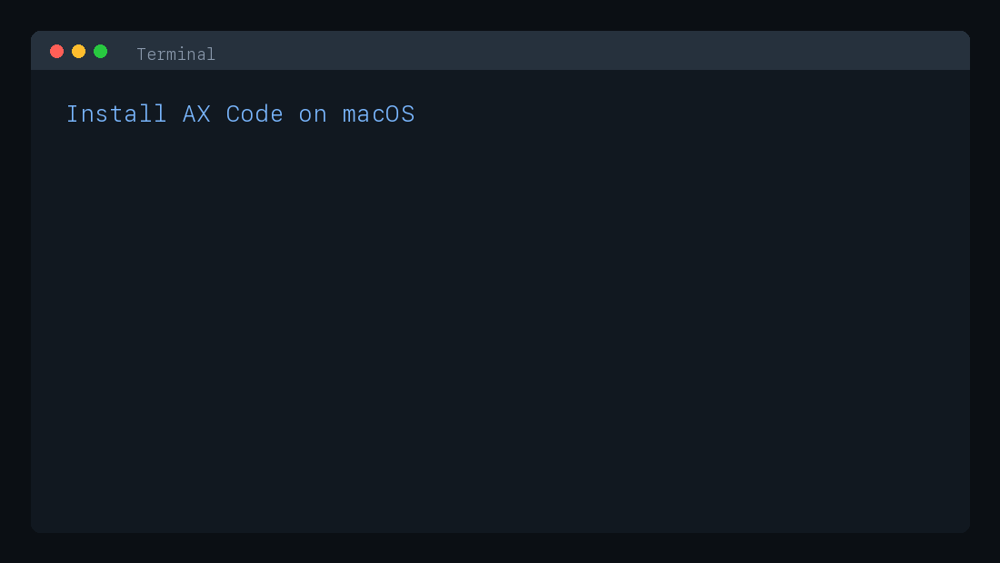

**A local-first agent runtime for serious software work.**

AX Code runs coding agents against your actual repositories through AX Code Desktop, a terminal TUI, one-shot CLI, VS Code, a TypeScript SDK, and a local HTTP server. It is built around durable sessions, explicit tools, sandboxed execution, provider routing, code intelligence, and MCP/plugin extensibility so teams can let agents act without losing control of the work.

- Work interactively in the terminal with model, provider, agent, session, MCP, and skill controls
- Run headless tasks for scripts, CI, bots, and internal automation with the same runtime
- Preserve work with persistent sessions, replay, fork, export, compare, rollback, and repo instructions in `AGENTS.md`
- Bound execution with `workspace-write`, `read-only`, or `full-access` isolation plus permission rules
- Extend with MCP servers, plugins, custom agents, Agent Skills, SDK tools, and VS Code integration

Built by [DEFAI Digital](https://github.com/defai-digital).

[](https://github.com/defai-digital/ax-code/releases/tag/v6.11.0)
[](https://github.com/defai-digital/ax-code/releases)
[](https://github.com/defai-digital/ax-code/releases)
[](https://github.com/defai-digital/ax-code/releases)
[](LICENSE)
[](https://discord.gg/cTavsMgu)

---

## Get Started

### Supported Install Targets

| Platform            | Status                  | Install path                                                      |
| ------------------- | ----------------------- | ----------------------------------------------------------------- |
| macOS Apple Silicon | Active support          | Homebrew CLI formula and Desktop cask                             |
| Windows x64         | Active support          | PowerShell CLI installer and Desktop release installer            |
| Windows ARM64       | Active support          | PowerShell CLI installer and Desktop release installer            |
| Linux               | Contributor/source only | Source builds only, without supported user installer expectations |

**Recommended: AX Code Desktop**

**macOS**

1. Install Homebrew if you do not already have it:

```bash
/bin/bash -c "$(curl -fsSL https://raw.githubusercontent.com/Homebrew/install/HEAD/install.sh)"
```

2. Install AX Code CLI and Desktop:

```bash
brew tap defai-digital/ax-code
brew tap defai-digital/ax-code-desktop
brew trust defai-digital/ax-code
brew trust defai-digital/ax-code-desktop
brew install defai-digital/ax-code/ax-code
brew install --cask defai-digital/ax-code-desktop/ax-code-desktop
```

Already have Homebrew? Start from step 2. The `brew trust` commands support Homebrew setups that require
explicit trust for third-party taps.



**Windows**

1. Install the AX Code CLI with PowerShell:

```powershell
powershell -NoProfile -ExecutionPolicy Bypass -Command "irm https://github.com/defai-digital/ax-code/releases/latest/download/install.ps1 | iex"
```

2. Install AX Code Desktop separately from the [latest GitHub Release](https://github.com/defai-digital/ax-code/releases/latest):

- Intel/AMD Windows: download and run the latest `AX-Code-<version>-win-x64.exe`.
- Windows on Arm: download and run the latest `AX-Code-<version>-win-arm64.exe`.

The PowerShell `install.ps1` path installs the CLI only. It does not install the Desktop app.

AX Code Desktop is the primary graphical workspace. It shares the AX Code runtime and provider setup, and its source lives in this monorepo under [`desktop/`](desktop/). The standalone Desktop source repository has been retired.

**Run**

```bash
ax-code
```

Or open **AX Code** from Applications / Start Menu to use the Desktop app. The terminal UI can also start or open the browser web UI with `/webui`, and shell users can run `ax-code webui`. The web UI prefers `http://127.0.0.1:3100` and scans upward if that port is busy. No project setup or config file is required. On first launch, connect a provider from the Desktop onboarding flow or use `/connect` inside the terminal UI.

**CLI-only install**

Use this path for terminals, headless tasks, CI jobs, bots, servers, and SDK/integration hosts.

**macOS**

```bash
brew tap defai-digital/ax-code
brew trust defai-digital/ax-code
brew install defai-digital/ax-code/ax-code
```

**Windows**

```powershell
powershell -NoProfile -ExecutionPolicy Bypass -Command "irm https://github.com/defai-digital/ax-code/releases/latest/download/install.ps1 | iex"
```

Supported CLI install paths are Homebrew (macOS) and the GitHub release installer for Windows PowerShell. The Windows PowerShell installer is CLI-only; use the Windows `.exe` release asset for Desktop. npm packages are no longer a supported channel. Use `-Version <release>` on Windows to pin a specific version. See [Installation and Runtime Channels](docs/install-runtime.md) for the full matrix.

AX Engine local inference is available only on eligible Apple Silicon Macs. Windows Desktop users should use hosted providers or OpenAI-compatible provider gateways; AX Code itself remains local-only and cannot be used as a remote server. For headless use, CI jobs, or preconfigured shells, AX Code also respects provider environment variables such as `GOOGLE_GENERATIVE_AI_API_KEY`, `GROQ_API_KEY`, `OPENROUTER_API_KEY`, `ZHIPU_API_KEY`, Alibaba plan keys, and `GITHUB_TOKEN`.

### Update

`ax-code upgrade` and package-manager update commands apply to the node-bundled runtime shipped by supported installers.

```bash
ax-code upgrade
```

**macOS**

```bash
brew upgrade defai-digital/ax-code/ax-code
brew upgrade --cask defai-digital/ax-code-desktop/ax-code-desktop
```

If `ax-code` is missing after a Homebrew upgrade (older setups installed the Desktop cask under the
conflicting `ax-code` token, which makes Homebrew skip linking the CLI formula), restore it with:

```bash
brew link ax-code
hash -r
```

**Windows**

```powershell
powershell -NoProfile -ExecutionPolicy Bypass -Command "irm https://github.com/defai-digital/ax-code/releases/latest/download/install.ps1 | iex"
```

This updates the Windows CLI. AX Code Desktop updates through the Desktop auto-updater, or by downloading the latest `AX-Code-<version>-win-x64.exe` / `AX-Code-<version>-win-arm64.exe` installer from GitHub Releases.

### From Source (contributors)

```bash
git clone https://github.com/defai-digital/ax-code.git
cd ax-code && pnpm install && pnpm run setup:cli
```

Requires [pnpm](https://pnpm.io) v10.33.4+ and [Node.js](https://nodejs.org) matching the root `package.json` engine (`>=24`, `>=26` for source-mode TUI commands that use `--experimental-ffi`). `setup:cli` builds and installs a node-bundled launcher. `ax-code doctor` should report `Runtime: Node vX.Y.Z (node-bundled)` — the same node-bundled runtime shipped by every supported install channel (Homebrew, Windows installer).

Refresh the local bundled runtime after code changes:

```bash
pnpm --dir packages/ax-code run build -- --single
pnpm run setup:cli -- --rebuild
ax-code doctor
```

For contributor-only source debugging, install the checkout-bound launcher explicitly:

```bash
pnpm run setup:cli -- --source
```

That source launcher should report `Runtime: Node vX.Y.Z (source)` and is intentionally separate from the default node-bundled launcher.

---

## What AX Code Does

AX Code is designed for agent work that touches real files, shells, sessions, and team policy. The same runtime powers every surface:

| Need                         | Use                                                                                                                         |
| ---------------------------- | --------------------------------------------------------------------------------------------------------------------------- |
| Desktop app                  | AX Code Desktop provides the graphical app from [`desktop/`](desktop/) as a separate Electron installable for macOS/Windows |
| Interactive coding           | `ax-code` opens the terminal UI with provider, model, agent, session, MCP, and skill flows                                  |
| One-shot automation          | `ax-code run "review the auth flow"` runs a bounded headless task                                                           |
| Local service / integrations | `ax-code serve` exposes the runtime over a local HTTP API and OpenAPI contract                                              |
| TypeScript embedding         | `@ax-code/sdk` provides `createAgent()`, streaming events, sessions, custom tools, and tests                                |
| VS Code                      | The VS Code integration uses the installed CLI/server while staying editor-native                                           |

## Current Capabilities

- **Terminal command center**: prompt editing, provider/model picker, agent picker, session list, MCP status, skill dialog, sandbox/autonomous toggles, and live tool progress.
- **Controlled execution**: tools such as read, edit, write, grep, glob, bash, web fetch/search, todo, task, and skill execution all pass through permission and isolation boundaries.
- **Durable sessions**: resume, fork, compact, export/import, replay, compare, rollback, and inspect session risk instead of losing work when a chat closes.
- **Repository intelligence**: `ax-code init` writes `AGENTS.md`; `ax-code index`, `graph`, semantic diff, LSP-backed context, and risk/DRE views help agents reason over larger codebases.
- **Provider flexibility**: connect hosted or local providers from `/connect` or `ax-code providers login`; list available models with `ax-code models`.
- **Extensibility**: add MCP servers, create custom agents, validate Agent Skills, and embed custom SDK tools without rebuilding the orchestration layer.

## Control Model

AX Code starts with autonomous mode on and runtime isolation in `workspace-write` by default: network is disabled, writes stay inside the workspace, and protected paths such as `.git/` and `.ax-code/` remain blocked. The agent can make progress without asking about every low-risk step, while the sandbox still enforces the boundary.

- Use `/sandbox`, `--sandbox read-only`, `--sandbox workspace-write`, or `--sandbox full-access` to change isolation intentionally.
- Use `/autonomous` or `AX_CODE_AUTONOMOUS=false` when you want the agent to stop for each permission or question.
- Use `ax-code mcp list --tools`, `ax-code mcp trust`, and permission rules to control external MCP tool surfaces.
- Provider and MCP credentials are encrypted at rest; server mode is localhost-only by default.

See [Sandbox Mode](docs/sandbox.md), [Autonomous Mode](docs/autonomous.md), [MCP Integrations](docs/mcp.md), and [SECURITY.md](SECURITY.md) for the full control model.

## Typical Workflow

1. Open a repository and run `ax-code`.
2. Use `/connect` to add a provider or switch models. For automation, use `ax-code providers login` or provider environment variables.
3. Run `ax-code init` so `AGENTS.md` captures local conventions, safety rules, and project context.
4. Keep the default sandbox for broad edits; change it only when the task needs a different boundary.
5. Run `ax-code index` on larger repos when semantic search and code-intelligence workflows matter.
6. Use `ax-code run`, `ax-code serve`, or `@ax-code/sdk` when the same agent workflow needs to move into scripts, CI, bots, or applications.

Grok defaults to `Grok Build CLI` in `/connect`, using the local `grok` command and its CLI login/session. The hosted `Grok Cloud API` provider still works for explicit `xai` configuration or existing credentials, but is hidden from the default provider list.

## Supported Providers and Models

Default setup flows support three provider families:

| Family                   | Providers                                                                                      | Model source                                                      |
| ------------------------ | ---------------------------------------------------------------------------------------------- | ----------------------------------------------------------------- |
| Cloud API providers      | Google, GroqCloud, OpenRouter, Alibaba Coding/Token Plan, GitHub Copilot, and Z.AI Coding Plan | Hosted provider model catalogs bundled with AX Code               |
| CLI providers            | Claude Code, Gemini CLI, Codex CLI, Grok Build CLI, Qoder CLI, and Antigravity CLI             | One model id per CLI bridge, using the local vendor CLI session   |
| AX Engine local provider | `ax-engine` on eligible Apple Silicon Macs                                                     | Curated 6-bit MLX MTP models: Qwen3.6, Gemma 4, and GLM 4.7 Flash |

See [Supported Providers and Models](docs/supported-providers.md) for provider ids, credential variables, and the exact supported model ids.

## Local AX Engine Models

AX Engine local inference is optimized for eligible Apple Silicon Macs. The built-in AX Code provider uses a
curated 6-bit MLX MTP model set and defaults to Qwen3.6-27B for the best daily balance of offline coding,
reasoning, and local memory fit. See [AX Engine Model Selection](docs/ax-engine-model-selection.md) for the
ranking, GLM-4.7-Flash placement, and memory-based recommendations.

## Documentation

- [Start Here](docs/start-here.md): understand what AX Code is, where the value comes from, and which docs to read next
- [Documentation Hub](docs/README.md): guides, architecture, specs, and reference docs
- [Sandbox Mode](docs/sandbox.md): isolation modes, protected paths, and network controls
- [Autonomous Mode](docs/autonomous.md): unattended execution behavior and safeguards
- [MCP Integrations](docs/mcp.md): trust, permissions, and prompt/resource safety for MCP servers
- [Auto-Route](docs/auto-route.md): keyword-based specialist routing and optional fast-model complexity routing
- [Supported Providers and Models](docs/supported-providers.md): Cloud API providers, CLI providers, and AX Engine model ids
- [AX Engine Model Selection](docs/ax-engine-model-selection.md): local AX Engine model ranking and memory guidance
- [Semantic Layer](docs/semantic-layer.md): provenance and replay boundaries for graph and LSP-backed answers

## Common Commands

| Command                                        | Purpose                                      |
| ---------------------------------------------- | -------------------------------------------- |
| `ax-code`                                      | Open the interactive terminal UI             |
| `ax-code run "debug why the build is failing"` | Run a one-shot headless task                 |
| `ax-code providers login`                      | Configure provider credentials               |
| `ax-code models`                               | List available provider/model IDs            |
| `ax-code init`                                 | Create or update repository `AGENTS.md`      |
| `ax-code index`                                | Build code-intelligence indexes              |
| `ax-code graph`                                | Inspect the repository graph                 |
| `ax-code mcp list --tools`                     | Review MCP servers, exposed tools, and rules |
| `ax-code mcp add`                              | Add a local or remote MCP server             |
| `ax-code agent create`                         | Generate a custom project or global agent    |
| `ax-code skill list`                           | List discovered Agent Skills                 |
| `ax-code serve`                                | Start the local HTTP/OpenAPI server          |
| `ax-code doctor`                               | Diagnose install, runtime, storage, and auth |

## Community

Report bugs, feature requests, and questions through [GitHub Issues](https://github.com/defai-digital/ax-code/issues). See [CONTRIBUTING.md](CONTRIBUTING.md) for the current contribution policy and [Discord](https://discord.gg/cTavsMgu) for community discussion.

## Provenance

AX Code is maintained by [DEFAI Private Limited](https://github.com/defai-digital). The repository includes code with upstream history from these MIT-licensed projects:

- [OpenCode](https://github.com/anomalyco/opencode): the AX Code CLI, runtime, session, provider, and tool foundations began as a DEFAI-maintained product built on the OpenCode codebase. See [NOTICE](NOTICE) for the root runtime attribution.
- [OpenChamber](https://github.com/btriapitsyn/openchamber): AX Code Desktop includes code derived from OpenChamber, adapted for the AX Code Desktop product, packaging, settings, and runtime model. See [desktop/NOTICE](desktop/NOTICE) for the Desktop attribution.
- [ax-cli](https://github.com/defai-digital/ax-cli): selected AX/CLI capabilities were ported from DEFAI's earlier ax-cli project. See [NOTICE](NOTICE) for the root attribution.

These notices preserve license provenance and upstream credit. They do not mean the upstream OpenCode, OpenChamber, or ax-cli projects maintain AX Code, AX Code Desktop, or current DEFAI modifications.

## License

AX Code is licensed under the [Apache License, Version 2.0](LICENSE) — Copyright (c) 2025 [DEFAI Private Limited](https://github.com/defai-digital).

Portions derived from MIT-licensed projects (notably OpenCode) remain under the [MIT License](LICENSE-MIT), and the vendored OpenTUI packages under `packages/opentui-*` remain MIT-licensed under their own LICENSE files. See [NOTICE](NOTICE), [LICENSE-MIT](LICENSE-MIT), [desktop/NOTICE](desktop/NOTICE), and the provenance section above for upstream attribution.
