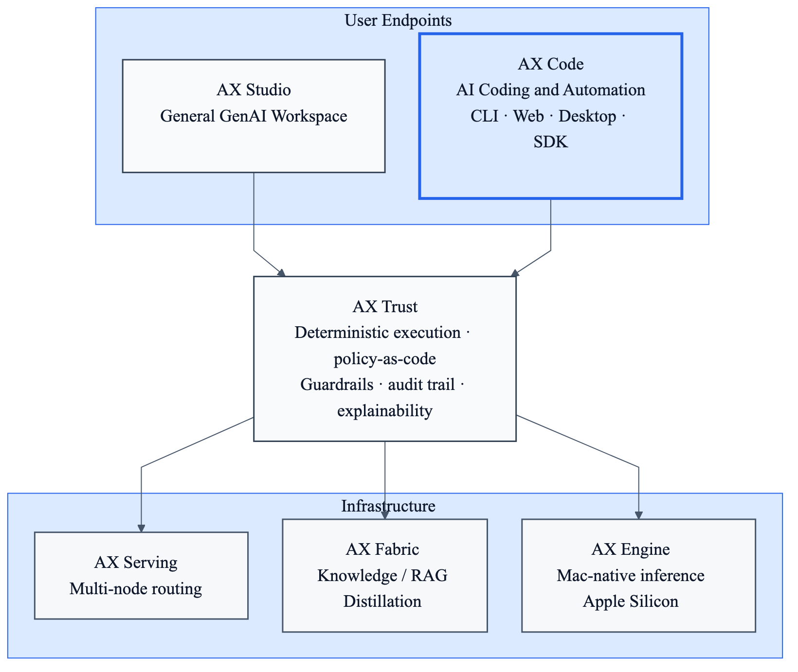

# AX Code

**Sovereign AI coding infrastructure — enterprise-grade, provider-agnostic, air-gap ready.**

The developer-facing entrypoint to the [AutomatosX](https://github.com/defai-digital) sovereign AI ecosystem. Use any LLM — cloud, on-prem, or air-gapped — with 9 specialized coding agents, governed by contract-first deterministic execution.

Built by [DEFAI Digital](https://github.com/defai-digital).

[](https://discord.gg/cTavsMgu)
[](LICENSE)

---

## Why AX Code?

Most AI coding tools are **clients of someone else's API**. Claude Code requires Anthropic. Copilot requires OpenAI. Cursor requires cloud. None of them let you own the full stack.

**AX Code is different.** It sits on top of a vertically integrated sovereign AI stack — with its own governance layer ([AX Trust](https://github.com/defai-digital/ax-trust)), orchestration engine ([AX Serving](https://github.com/defai-digital/ax-serving)), knowledge infrastructure ([AX Fabric](https://github.com/defai-digital/ax-fabric)), and native inference engine ([AX Engine](https://github.com/defai-digital/ax-engine)). Your code never has to leave your network.

### What Makes It Sovereign

- **Provider-agnostic.** Use Claude, GPT, Gemini, Grok, DeepSeek, or run models locally with [AX Engine](https://github.com/defai-digital/ax-engine) / [AX Studio](https://github.com/defai-digital/ax-studio) / Ollama. Switch freely. No vendor lock-in.
- **Air-gap ready.** Run 100% offline on Mac Studio, Jetson Thor, or any local hardware. Zero cloud dependency. Defence and classified environments supported.
- **Contract-first governance.** Every agent action flows through AX Trust for policy enforcement, audit trail, and deterministic execution. Same input, same output.
- **Full audit trail.** Every tool call, every file change, every LLM interaction — traceable, explainable, exportable.

### What Makes It Better for Coding

- **9 specialized agents.** Not a generic chatbot. Security auditor, architect, debugger, performance profiler, planner, and more — auto-routing based on what you're working on.
- **Real code intelligence.** LSP integration with TypeScript, Python, Go, Rust, and more. Actual go-to-definition, find-references, and diagnostics.
- **25+ built-in tools.** File operations, shell execution, code search, web fetch, batch processing, task management.
- **Use it everywhere.** Terminal, desktop app, web browser, VS Code, headless API, or embed via SDK.

---

## The AutomatosX Stack

AX Code is the coding surface of a vertically integrated sovereign AI platform:

<p align="center">
  
</p>

Source: [docs/automatosx-stack.mmd](docs/automatosx-stack.mmd)

| Component | Repository | Role |
|-----------|-----------|------|
| **AX Studio** | [defai-digital/ax-studio](https://github.com/defai-digital/ax-studio) | General GenAI workspace — enterprise knowledge + agentic workflows |
| **AX Code** | [defai-digital/ax-code](https://github.com/defai-digital/ax-code) | AI coding & automation — developer-optimized entrypoint |
| **AX Trust** | — | Deterministic AI pipeline — contract-based execution, guardrails, audit |
| **AX Serving** | [defai-digital/ax-serving](https://github.com/defai-digital/ax-serving) | Enterprise orchestration — multi-node routing, heterogeneous compute |
| **AX Fabric** | [defai-digital/ax-fabric](https://github.com/defai-digital/ax-fabric) | Knowledge infrastructure — RAG, distillation, knowledge lifecycle |
| **AX Engine** | [defai-digital/ax-engine](https://github.com/defai-digital/ax-engine) | Mac-native inference — Apple Silicon optimized, 30B-70B+ models |

---

## Who Is AX Code For?

### Enterprise Engineering Teams

- Need AI coding without surrendering code sovereignty
- Run multiple AI providers — can't standardize on one vendor
- Security team requires full audit trail of what the AI did
- Need governance, cost control, and compliance reporting

### Defence & Government

- Classified environments that cannot send code to external APIs
- Air-gapped deployment on Mac Studio Grid / Jetson Thor Grid
- Reproducible, deterministic AI execution for compliance
- No foreign cloud dependency

### Platform Engineering Teams

- Embed AI coding into CI/CD pipelines via headless API
- Build internal developer platforms with the programmatic SDK
- Cost-aware model routing across multiple providers
- Custom enterprise agents via plugin system

### Individual Developers

- Use Claude, GPT, Gemini, Grok, local models — switch freely
- 9 specialized agents vs. a generic chatbot
- Open source and free
- Not locked into any vendor's ecosystem

---

## Get Started in 60 Seconds

```bash
# Install
git clone https://github.com/defai-digital/ax-code.git
cd ax-code && pnpm install && pnpm run setup:cli

# Set any provider key (pick one)
export GOOGLE_GENERATIVE_AI_API_KEY="your-key"   # Gemini
export XAI_API_KEY="your-key"                     # Grok
export GROQ_API_KEY="your-key"                    # Groq (free tier)

# Launch
ax-code
```

**Prerequisites:** [pnpm](https://pnpm.io) v9.15.9+ and [Bun](https://bun.sh) v1.3.11+

---

## Supported Providers

### Cloud

| Provider | Models | Setup |
|----------|--------|-------|
| **Anthropic** | Claude Opus, Sonnet, Haiku | `ANTHROPIC_API_KEY` |
| **OpenAI** | GPT-5, GPT-4, o3, o4 | `OPENAI_API_KEY` |
| **Google** | Gemini 3.0, 3.1 | `GOOGLE_GENERATIVE_AI_API_KEY` |
| **xAI** | Grok-2, Grok-3, Grok-4 | `XAI_API_KEY` |
| **DeepSeek** | Chat, Reasoner | `DEEPSEEK_API_KEY` |
| **Groq** | Llama, Qwen, Gemma, DeepSeek | `GROQ_API_KEY` (free) |
| **GitHub Copilot** | Claude, GPT, Gemini via Copilot | `ax-code providers login` |
| **Alibaba Cloud** | Qwen3, Qwen3-Coder | `DASHSCOPE_API_KEY` |
| **Azure** | GPT, Claude, Llama, Phi | `AZURE_API_KEY` |
| **Perplexity** | Sonar, Sonar Pro, Deep Research | `PERPLEXITY_API_KEY` |
| **Z.AI** | GLM-4.5, GLM-4.7, GLM-5 | `ax-code providers login` |

### Local / Sovereign (Offline, Air-Gapped)

| Provider | Setup |
|----------|-------|
| **AX Engine** | Apple Silicon optimized inference — [defai-digital/ax-engine](https://github.com/defai-digital/ax-engine) |
| **AX Studio** | Auto-detected at `localhost:11434` or `AX_STUDIO_HOST` — [defai-digital/ax-studio](https://github.com/defai-digital/ax-studio) |
| **Ollama** | Auto-detected at `localhost:11434` or `OLLAMA_HOST` |
| **LM Studio** | Configure in `ax-code.json` |

Local providers auto-discover running models — no API key needed. Your code never leaves your machine.

---

## Core Features

### Specialized AI Agents

AX Code doesn't use a single generic assistant. It ships with **9 purpose-built agents**, each with tailored system prompts, tool access, and permission boundaries.

| Agent | What It Does | Auto-routes When You Say... |
|-------|-------------|---------------------------|
| **build** | General development — full tool access | *(default agent)* |
| **security** | Vulnerability scanning, secrets detection, OWASP analysis | "scan for vulnerabilities", "security audit" |
| **architect** | System design analysis, dependency review, coupling detection | "analyze architecture", "review structure" |
| **debug** | Bug investigation, root cause analysis, systematic fixes | "debug this", "why is it crashing" |
| **perf** | Bottleneck detection, memory profiling, optimization | "too slow", "optimize", "performance" |
| **plan** | Read-only task decomposition and planning | *(manual switch via Tab)* |
| **react** | Structured Thought/Action/Observation reasoning | *(manual switch via Tab)* |
| **general** | Parallel multi-step task execution | *(subagent)* |
| **explore** | Fast codebase search and navigation | *(subagent)* |

**Agent auto-routing** analyzes your message and switches to the right agent automatically. A toast notification tells you when it happens. You can also switch manually with **Tab**.

### Language Server Integration (LSP)

AX Code talks to real language servers — the same ones your IDE uses.

- **Go to definition** — Jump to where a function/type is defined
- **Find references** — See every usage across the codebase
- **Hover info** — Get type signatures and documentation
- **Call hierarchy** — Trace incoming and outgoing calls
- **Diagnostics** — Surface real compiler errors and warnings

Supports TypeScript, Python (Pyright), Go (gopls), Rust (rust-analyzer), Ruby (Solargraph), C/C++ (clangd), and more.

### 25+ Built-in Tools

| Category | Tools |
|----------|-------|
| **File operations** | read, write, edit, glob, ls, multiedit |
| **Code search** | grep (regex), codesearch (web), websearch |
| **Shell execution** | bash (with timeout and sandboxing), pty (interactive) |
| **LSP queries** | definition, references, hover, symbols, call hierarchy, diagnostics |
| **Planning** | task, todo, plan enter/exit |
| **Web** | webfetch (URL to markdown), websearch |
| **Batch** | Parallel tool execution |

### Session Persistence

Every conversation is stored in SQLite. You can:

- **Resume** any previous session
- **Fork** a session to explore different approaches
- **Compact** sessions to reduce token usage
- **Export/Import** sessions as JSON

### MCP (Model Context Protocol)

Connect to external tools and services via MCP with 16 pre-configured templates:

| Category | Servers |
|----------|---------|
| **Search & Web** | Exa, Brave Search |
| **Developer Tools** | GitHub, GitLab, Linear, Sentry |
| **Databases** | PostgreSQL, SQLite |
| **Browser** | Puppeteer, Playwright |
| **Cloud** | Vercel, Cloudflare |
| **Design** | Figma |
| **Communication** | Slack |

```bash
ax-code mcp add              # Add from template or custom
ax-code mcp list --discover  # Auto-detect available servers
```

Supports SSE, HTTP, and stdio transports with OAuth authentication.

### AX.md Context System

Generate AI-optimized project context that helps every conversation start informed:

```bash
ax-code init                 # Generate AX.md context
ax-code init --depth full    # Deep analysis with code patterns
ax-code memory warmup        # Pre-cache for faster responses
```

### Design Check

Scan CSS/React code for design system violations:

```bash
ax-code design-check src/
```

Catches hardcoded colors, raw spacing values, inline styles, missing alt text, and missing form labels.

### Self-Correction & ReAct Reasoning

- **Self-correction** — Detects failures, reflects on what went wrong, and retries with a different approach
- **ReAct mode** — Structured Thought -> Action -> Observation loops for complex multi-step problems
- **Planning system** — Decomposes large tasks into dependency-ordered steps with verification

---

## Security & Governance

### Execution Sandbox

Control what the AI agent can access with three isolation modes:

| Mode | Behavior |
|------|----------|
| **Read-only** | Blocks all file mutations and shell commands |
| **Workspace write** *(default)* | Allows writes only inside the workspace; `.git` and `.ax-code` always protected |
| **Full access** | Disables isolation (explicit opt-in) |

```bash
ax-code --sandbox read-only
```

Network access for tools is disabled by default in read-only and workspace-write modes. Isolation violations trigger an approval prompt.

### Permission System

Fine-grained, per-agent, per-tool, per-file-pattern permission rules:

- **Pattern-based rules** — glob patterns for file paths (e.g., allow read on `src/**`, deny write on `.env`)
- **Agent-scoped permissions** — security agent gets read-only by default, build agent gets full access
- **Bash command analysis** — tree-sitter parsing detects rm, cp, mv, mkdir and enforces workspace boundaries
- **Three-state model** — allow (auto), deny (block), ask (prompt user)

### Credential Encryption

All API keys, OAuth tokens, and account credentials are encrypted at rest with **AES-256-GCM**. See [SECURITY.md](SECURITY.md) for the full threat model.

### Server Security

- Binds to **localhost only** by default
- Network binding requires `AX_CODE_SERVER_PASSWORD`
- CORS and authentication enforced

### AX Trust Integration (Roadmap)

When connected to the AutomatosX stack, ax-code gains enterprise governance through [AX Trust](https://github.com/defai-digital/ax-trust):

- **Contract-based deterministic execution** — same input, same output
- **Policy-as-code** — declarative YAML policies for what agents can do
- **Full audit trail** — every action cryptographically anchored, exportable to SIEM
- **Explainability** — complete reasoning chain for every decision

---

## Use It Your Way

### Terminal (TUI)

```bash
ax-code                      # Launch interactive TUI
ax-code run "fix the login bug"  # One-shot non-interactive mode
```

The terminal UI features a customizable theme system (GitHub default), context stats, agent switching, and real-time streaming.

### Desktop App

Native cross-platform desktop app built with Tauri:

```bash
pnpm --dir packages/desktop tauri dev
```

Available for macOS (Apple Silicon & Intel), Windows, and Linux.

### Web App

```bash
ax-code serve --port 4096          # Start the backend
pnpm --dir packages/app dev        # Start the web UI
```

Full-featured web interface with chat, file explorer, terminal emulator, and model selection.

### VS Code Extension

Use ax-code directly inside VS Code:

1. `Ctrl+Shift+P` -> **"Install from VSIX"** -> select `sdks/vscode/ax-code-1.4.0.vsix`
2. Open the sidebar panel with `Ctrl+Shift+A`

**Features:** chat panel, explain/review/fix via right-click, code selection actions, integrated terminal.

### Headless API

Run ax-code as a server for CI/CD pipelines, internal platforms, or automated workflows:

```bash
ax-code serve --port 4096    # Start headless API server
```

Integrates with CI/CD for automated code review, security scanning, and code generation.

### Programmatic SDK

Build AI-powered applications with the SDK — no HTTP server needed:

```typescript
import { createAgent } from "@ax-code/sdk/programmatic"

const agent = await createAgent({
  directory: process.cwd(),
  auth: { provider: "xai", apiKey: "your-key" },
})

// One-shot execution
const result = await agent.run("Fix the login bug")
console.log(result.text, result.usage.totalTokens)

// Streaming with callbacks
const stream = agent.stream("Refactor this function")
stream.on("text", (t) => process.stdout.write(t))
stream.on("tool-call", (tool) => console.log("Using:", tool))
await stream.done()

// Multi-turn sessions
const session = await agent.session()
await session.run("Read src/auth/index.ts")
await session.run("Now add input validation")

// Discovery
const models = await agent.models()   // 78+ models
const tools = await agent.tools()     // 15 built-in tools

await agent.dispose()
```

**SDK highlights:**
- In-process execution (< 1s startup, no server)
- Typed errors: `ProviderError`, `TimeoutError`, `ToolError`, `DisposedError`
- Stream helpers: `.text()`, `.result()`, `.on()`, `.done()`
- Auto-retry with exponential backoff
- Agent auto-routing works through SDK
- Hooks: `onToolCall`, `onToolResult`, `onPermissionRequest`, `onError`

---

## Configuration

Create `ax-code.json` in your project root or `~/.config/ax-code/ax-code.json` for global settings:

```json
{
  "provider": {
    "google": {
      "options": { "apiKey": "your-key" }
    }
  }
}
```

Config is hierarchical: remote org defaults -> global -> custom path -> project -> `.ax-code/` directory -> managed overrides.

### Key Environment Variables

| Variable | Purpose |
|----------|---------|
| `ANTHROPIC_API_KEY` | Claude |
| `OPENAI_API_KEY` | GPT |
| `GOOGLE_GENERATIVE_AI_API_KEY` | Gemini |
| `XAI_API_KEY` | Grok |
| `DEEPSEEK_API_KEY` | DeepSeek |
| `GROQ_API_KEY` | Groq (free) |
| `AX_CODE_ISOLATION_MODE` | Sandbox: `read-only`, `workspace-write`, `full-access` |
| `AX_CODE_SERVER_PASSWORD` | Required for network-bound server |

---

## CLI Reference

```bash
# Core
ax-code                              # Launch TUI
ax-code run "message"                # Non-interactive mode
ax-code serve                        # Headless API server
ax-code --sandbox read-only          # Read-only mode

# Providers & Models
ax-code providers list               # List providers
ax-code providers login              # Add credential
ax-code providers login groq         # Quick setup
ax-code models                       # List models

# Project Context
ax-code init                         # Generate AX.md
ax-code init --depth full            # Full analysis
ax-code memory warmup                # Pre-cache context

# MCP
ax-code mcp add                      # Add MCP server
ax-code mcp list --discover          # Auto-detect servers

# Analysis
ax-code design-check src/            # Design violations
ax-code context                      # Token usage & cost
ax-code stats                        # Usage statistics

# Sessions
ax-code session list                 # List sessions
ax-code export <sessionID>           # Export as JSON
```

---

## Project Structure

```
ax-code/
├── packages/
│   ├── ax-code/           # Core CLI — agents, tools, providers, server
│   ├── app/               # Web UI (SolidJS)
│   ├── desktop/           # Desktop app (Tauri)
│   ├── sdk/js/            # JavaScript/TypeScript SDK
│   ├── plugin/            # Plugin system
│   ├── ui/                # Shared UI components
│   ├── util/              # Shared utilities
│   └── script/            # Build & release scripts
└── docs/                  # Documentation
```

---

## Built With

[Bun](https://bun.sh) | [TypeScript](https://typescriptlang.org) | [Vercel AI SDK](https://sdk.vercel.ai) | [SolidJS](https://solidjs.com) | [Hono](https://hono.dev) | [Drizzle ORM](https://orm.drizzle.team) | [Effect](https://effect.website) | [Tauri](https://tauri.app)

---

## Project History

AX Code was built by combining two open source projects:

1. **[ax-cli](https://github.com/defai-digital/ax-cli)** — DEFAI Digital's original AI coding CLI with specialized agents, auto-routing, design checking, memory warmup, and the programmatic SDK.
2. **[OpenCode](https://github.com/anomalyco/opencode)** — A provider-agnostic, LSP-first AI coding assistant with a rich terminal UI, session persistence, and MCP support.

AX Code is now the developer-facing entrypoint to the [AutomatosX](https://github.com/defai-digital) sovereign AI ecosystem.

---

## Contributing

We welcome bug reports and feature requests through [GitHub Issues](https://github.com/defai-digital/ax-code/issues). See [CONTRIBUTING.md](CONTRIBUTING.md) for details.

## Community

Join us on [Discord](https://discord.gg/cTavsMgu).

## Language

The UI is English only. AI responses support any language your chosen model supports.

## Changelog

See [GitHub Releases](https://github.com/defai-digital/ax-code/releases).

## License

[MIT](LICENSE) — Copyright (c) 2025 [DEFAI Private Limited](https://github.com/defai-digital). Portions derived from [OpenCode](https://github.com/anomalyco/opencode), Copyright (c) 2025 opencode.

## Credits

Built by [DEFAI Digital](https://github.com/defai-digital), with thanks to the [OpenCode](https://github.com/anomalyco/opencode) project and its contributors.
