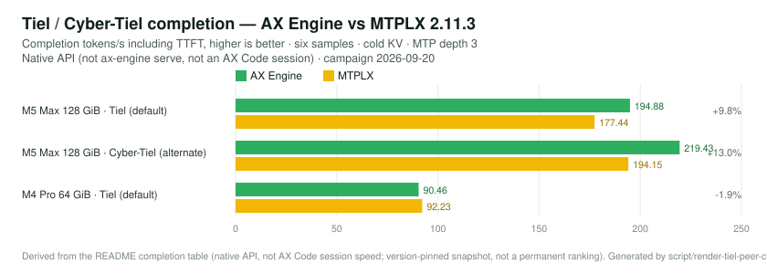

```
___________  __     _________________________________
___    |_  |/ /     __  ____/_  __ \__  __ \__  ____/
__  /| |_    /_______  /    _  / / /_  / / /_  __/
_  ___ |    |_/_____/ /___  / /_/ /_  /_/ /_  /___
/_/  |_/_/|_|       \____/  \____/ /_____/ /_____/
```

<h1 align="center">AX Code</h1>

<p align="center"><strong>Inspect the run. Verify the change. Decide what stays.</strong></p>
<p align="center"><strong>Local coding agent with managed inference on Apple Silicon.</strong></p>

AX Code is an open-source coding-agent runtime for reviewable, reversible work. Run a 35B-class coding model on a single Apple Silicon laptop with managed lifecycle, and keep an evidence record of every change. Sessions are recorded as structured event logs with file snapshots, so you can reconstruct what the agent did, compare two runs against each other, and roll back what you do not want. Candidate implementations can be built in isolated Git worktrees and ranked against your repository's own checks — nothing merges automatically.

Built by [DEFAI Digital](https://github.com/defai-digital).

[](https://github.com/defai-digital/ax-code/releases/tag/v7.19.5)
[](https://github.com/defai-digital/ax-code/releases)
[](https://github.com/defai-digital/ax-code/releases)
[](https://github.com/defai-digital/ax-code/releases)
[](LICENSE)
[](https://discord.gg/gf9UyPxaN2)

---

## Standard and Business

**AX Code Standard** is open-source AI coding for individuals and teams, built to work
with local and cloud models. It remains free for personal and commercial use under
Apache-2.0, with the existing upstream license notices preserved. Companies can use
Standard without buying Business. Model-provider and hardware costs are separate.

**AX Code Business** is a planned, separately licensed proprietary offering built around
AX Trust governance and the AutomatosX ecosystem: company-managed AI access, centrally
retained records, and connected internal workflows. Standard keeps the complete core
coding experience, local evidence, and basic safety capabilities.

v8.0 is upcoming. Business features, pricing, and deployment availability are not yet
being announced as generally available. Computer use (CUA) is planned for v8.1.
Read [Standard and Business](docs/getting-started/editions.md) for the edition boundaries,
local inference scope, licensing, and current public-access status.

## Apple Silicon, managed local inference

AX Code itself runs from 8 GB of RAM on an Apple Silicon M2 Mac. The managed local-inference path
is a different envelope: to run a 35B-class coding model through AX Engine, we recommend an Apple
Silicon M4 Pro with 48 GB of unified memory or above (for example a Mac Mini M4 Pro 48 GB). On
that class of machine the
[Tiel Coder 35B A3B MXFP4 MTP](docs/providers/ax-engine-model-selection.md) pack runs in its
native MXFP4 quantization without quantization-to-fit compromises, and AX Engine manages the
process end to end: model selection, download, MTP policy enforcement, live text-and-tool contract
verification, and managed start/shutdown. The catalog budgets roughly 64 GiB as a conservative
full-context (64K) planning figure — weights, KV cache, buffers, and host reserve — so confirm the
live catalog fit result for your machine rather than sizing to the model file alone.

Speed is hardware-bound. AX Code does not impose a tokens-per-second ceiling; faster hardware
produces tokens faster. **AX Code session throughput is not engine tok/s:** a coding turn also
pays tool rounds, prompt growth, HTTP sidecar overhead, and cache state.

The current matched peer numbers are native AX Engine versus MTPLX **2.11.3** on **20 September
2026** (six measured samples, cold KV, MTP depth 3). The primary metric is **completion tokens/s
including TTFT**. These are native-API measurements, not default `ax-engine serve` and not AX Code
sessions. AX Code bundles signed AX Engine **7.5.3**.

<p align="center">
  
</p>

On MacBook Pro **M5 Max 128 GiB**, the managed default
[Tiel Coder 35B A3B MXFP4 MTP](docs/providers/ax-engine-model-selection.md) pack completed at
**194.88 tok/s** versus MTPLX 177.44 on `python-lru`. Decode for that cell was 217.85 versus 198.40.
The fastest decode cell in the campaign is the alternate **Cyber-Tiel** pack at **249.01 tok/s**
(completion 219.43). Cyber-Tiel is not the managed default, and its managed read-task probes remain
unresolved. On a Mac mini **M4 Pro 64 GiB**, Tiel completion is about 90 tok/s. **M5 Max 128 GiB is
the campaign host, not the minimum** — see the M4 Pro 48 GB+ recommendation above.

| Host           | Pack (default unless noted)         | Completion tok/s (incl. TTFT) |         Decode tok/s |
| -------------- | ----------------------------------- | ----------------------------: | -------------------: |
| M5 Max 128 GiB | Tiel `python-lru`                   |          **194.88** vs 177.44 |     217.85 vs 198.40 |
| M5 Max 128 GiB | Cyber-Tiel `python-lru` (alternate) |              219.43 vs 194.15 | **249.01** vs 219.84 |
| M4 Pro 64 GiB  | Tiel `python-lru`                   |                90.46 vs 92.23 |     109.12 vs 107.04 |

Source: [AX Engine four-machine report](https://github.com/defai-digital/ax-engine/blob/main/docs/performance/tiel-vs-mtplx-2026-09-20.md)
and the [AX Code summary](docs/guides/tiel-peer-2026-09-20.md). The 19 September M3 Max snapshot
(47–58 versus 92–96 decode on a 7.4.0-identifying source build) is historical only:
[Tiel prefill/decode benchmark](docs/guides/tiel-runtime-phases-2026-09-19.md). Both packs are
development requantizations with no certified quality-parity or MTP-speed claim.

AX Engine's own first-run pack is dense **Qwen 3.8 27B AXQ 6-bit MTP**, not Tiel. It is
excluded from AX Code's managed catalog; serve it with `ax-engine serve qwen3.8-27b:axq`
and attach as a local endpoint if you want that model. Direct AR already uses 95–98% of
published memory bandwidth (mlx-lm 12.78 tok/s on M4 Pro, 27.90 on M5 Max). Product-path
MTP is **31.05 tok/s** decode / **120.3 tok/s** prefill on Mac mini M4 Pro 64 GB (**2.43×**
direct) and **76.90 tok/s** decode / **795.3 tok/s** prefill on M5 Max 128 GB (**2.76×**
direct). Do not compare those dense-27B decode numbers with Tiel completion tok/s.
See [AX Engine Qwen 27B performance](https://github.com/defai-digital/ax-engine#qwen-performance).

The largest practical payoff is the local prefix cache. A repeated 285-token task with a full
36,708-token KV cache returned its first payload in 0.04 seconds on MTPLX — see the
[AX Code / OpenCode client retest](docs/guides/local-client-matrix-2026-09-19.md). AX Engine 7.5.0
or newer is required; older binaries lack the Tiel MTP namespace loader fix and reject these packs
with `MlxMtpRequiredButUnavailable`. MTP policy is required by default: an unavailable drafter
fails startup instead of silently falling back to direct decoding, because a silent fallback would
change the model's effective behavior without telling you.

Local inference is one runtime among many. AX Code also connects to MTPLX, oMLX, Ollama, LM Studio,
AX Studio, and any OpenAI-compatible endpoint, so the speed/quality/runtime tradeoff is yours to
make. Cloud API, CLI, private GPU cloud, and AX Trust providers remain available whenever you want
them — local is the default path, not a lock-in.

## The problem

Coding agents now write real code in real repositories. The gap is what happens after the agent says it is done: which files it touched, which decisions it made, whether the result passes your checks, how one attempt compared with another, and how to undo the specific step that went wrong.

Most agents give you a transcript. AX Code gives you an execution record.

## What that looks like

Every session is recorded while it runs. Afterwards you can compare two runs directly:

```console
$ ax-code session compare ses_01H8XK ses_01H8XM

  Session Comparison
  ============================================================

  A: ses_01H8XK
     add rate limiting to the ingest API
     Risk: HIGH (53/100) — 8 files changed, rewrite, cross-module change

  B: ses_01H8XM
     add rate limiting to the ingest API (second attempt)
     Risk: CRITICAL (93/100) — 25 files changed, rewrite, security-related files,
                               cross-module change, 15 tool failures

  Risk Comparison
  ----------------------------------------
  Score: 53 → 93 (+40) ↑
  Level: HIGH → CRITICAL
  Files: 8 → 25
  Failures: 0 → 15

  Event Summary
  ----------------------------------------
  tool.call: 12 → 127
  step.finish: 6 → 90
  Total: 69 → 817
```

Or reconstruct a single run step by step, with timings:

```console
$ ax-code graph ses_01H8XK

## Session ses_01H8XK

Duration: 9m 54s | Risk: HIGH (53/100) | Tokens: 167,650 in / 18,494 out
Agents: architect

### Step 1 (8s) | tokens: 12263/587

- read: api.ts → ok (5ms)
- grep: rateLimit → ok (12ms)

### Step 2 (4m 42s) | tokens: 12327/3626

- task: explore rate limiter call sites → ok (215021ms)
```

The output format above is verbatim from these commands; the session IDs and task names are illustrative. The risk score is a deterministic heuristic computed from signals including churn, validation state, tool failures, touched paths, affected API surface, control-plane outcomes, and security-sensitive file patterns — it is a review aid, not a probability, a confidence measure, or a security assurance.

## What you get

**Run inference on your own machine.** On Apple Silicon, AX Code manages a 35B-class coding model through AX Engine — selection, download, MTP policy, live text-and-tool contract verification, and managed start/shutdown — and connects to MTPLX, oMLX, Ollama, LM Studio, AX Studio, or any OpenAI-compatible endpoint. Cloud API, CLI, private-GPU, and AX Trust providers are equally first-class. See [AX Engine Model Selection](docs/providers/ax-engine-model-selection.md).

**Inspect what the agent did.** `ax-code graph` reconstructs the session as an execution graph with per-step tool calls and timings. `ax-code session compare` diffs two runs by risk, decision path, and event counts. `ax-code session trace` produces replay-backed diagnostics. The evidence exports out of AX Code as JSONL (`ax-code audit export`), a Markdown report (`ax-code audit report`), or OpenTelemetry spans (`ax-code audit otlp`).

**Undo precisely.** File changes are snapshotted to an out-of-tree Git object store during the run. `ax-code session rollback <session> --list` shows recoverable points; `--step N` restores a specific one. Rollback depends on a usable snapshot, so it has real boundaries — see [Execution Evidence](docs/guides/execution-evidence.md).

**Verify competing implementations.** In arena implement mode, each contestant gets an isolated worktree from the same clean base commit, its patch is snapshotted to a branch, your repository's typecheck/lint/test commands run, and candidates that verify rank above candidates that do not. AX Code does not merge the winner for you.

**Understand impact before editing.** With the code-intelligence graph built (`ax-code index`), the agent can compute the blast radius of a proposed change — transitive callers, API boundaries hit, and a bounded risk score — deterministically, with no model call and no file reads.

**Keep repository knowledge durable.** `ax-code wiki` compiles a source-backed wiki: deterministic page planning, source-hash change detection, protected manual sections, atomic writes, and lint checks including dead links. Page prose is model-generated from cited source; the planning, validation, and incremental-update framework around it is deterministic.

## Hardware requirements

Choose hardware for the repository tools as well as AX Code. These are capacity-planning guidelines, not certified performance limits; the 8 GB baseline has not been validated by a physical-machine load test.

| Workload                                                                             | Minimum planning baseline                                                                  | Recommended target                                                                                                                                                                    |
| ------------------------------------------------------------------------------------ | ------------------------------------------------------------------------------------------ | ------------------------------------------------------------------------------------------------------------------------------------------------------------------------------------- |
| Cloud/API models (including CLIs using remote models), one session, small repository | 8 GB system RAM; expect limited headroom for a browser, build and language server          | 16 GB RAM, modern 4-core or better CPU, SSD                                                                                                                                           |
| Large TypeScript/Rust repositories, concurrent builds or several agents/sessions     | Start from the 16 GB cloud target; 8 GB is not a suitable planning baseline                | 32 GB or more RAM; size for your actual language servers and builds                                                                                                                   |
| Local inference                                                                      | The selected model/runtime requirements, plus RAM for AX Code, repository tools and the OS | For the default 35B AX Engine pack, an Apple Silicon M4 Pro with 48 GB+ unified memory (e.g. Mac Mini M4 Pro 48 GB); budget weights, KV cache/context and runtime overhead separately |

Supported packaged CPU/OS targets are Apple Silicon macOS, Windows x64/ARM64 and Ubuntu 24.04+ amd64/arm64. Cloud inference does not require a local GPU. Reserve SSD space for the runtime, repository, dependencies, session history and temporary command output; 10 GB of free space is a starting headroom target, not a disk-usage cap. Large builds and local model downloads need substantially more.

AX Code automatically selects the `low` memory profile on hosts reporting at most 8 GiB of physical RAM. It skips speculative language-server prewarming, limits concurrent analysis work and stops idle language servers; analysis still starts on demand and may take longer. It does not impose a machine-wide RAM limit. A language server, compiler, browser or local model can still exhaust an 8 GB system. Hosts below 8 GB are not recommended for interactive coding.

To select the profile explicitly on macOS/Linux:

```bash
AX_CODE_MEMORY_PROFILE=low ax-code
```

On PowerShell:

```powershell
$env:AX_CODE_MEMORY_PROFILE = "low"
ax-code
```

Use `auto` (default) to restore detection or `normal` for normal cache and concurrency budgets. Both profiles start semantic analysis on demand; ordinary reads do not prewarm language servers. On a host with sufficient headroom, `AX_CODE_MEMORY_PROFILE=normal AX_CODE_LSP_PREWARM=1 ax-code` restores speculative startup/read prewarming to reduce first-query latency. The evidence cache uses bounded memory by default; RocksDB is opt-in. These controls preserve model selection and required checks; they do not certify arbitrary projects for low-RAM hardware. See [Memory usage](docs/guides/memory-usage.md) for limits and workload guidance.

AX Code's 8 GB baseline covers the agent runtime and cloud/API inference; it is not a local
inference floor. To run the default 35B-class MXFP4 MTP pack through managed AX Engine, we
recommend an Apple Silicon M4 Pro with 48 GB of unified memory or above (for example a Mac Mini
M4 Pro 48 GB). The catalog's ~64 GiB figure is a conservative full-context planning estimate
(weights, KV cache, buffers, and host reserve); use the live catalog fit result for your machine.
Smaller Macs can still use AX Code with cloud/API models or connect to lighter local runtimes via
the [MTPLX / oMLX presets](docs/providers/local-mlx-runtimes.md). AX Engine 7.5.0 or newer is
required; older binaries fail with `MlxMtpRequiredButUnavailable`. See
[AX Engine Model Selection](docs/providers/ax-engine-model-selection.md) for memory guidance, the
managed activation contract, and the MTP policy.

## Get started

**Public downloads are temporarily unavailable (2026-09-16).** The original GitHub
repository is private, so the release installer URLs below return 404 for anonymous
users. Homebrew also downloads its archive from that repository. These commands document
the existing channels; they are not currently usable public installation paths. See the
[website guide](https://ax-code.app/en/download/) for installation updates. The Standard
open-source direction does not itself change repository visibility or restore downloads.

### macOS (Apple Silicon)

Use the standalone release installer (recommended; Homebrew is not required):

```bash
curl -fsSL https://download.ax-code.com/install | bash
```

If you already manage tools with Homebrew, it remains a supported alternative:

```bash
brew tap defai-digital/tap
brew trust defai-digital/tap
brew install defai-digital/tap/ax-code
```

Trusting the tap allows Homebrew to load all current and future formulae and casks published there.
Existing Homebrew users do not need to migrate. Use one installation channel for `ax-code`;
`ax-code upgrade` follows the active installation, while `brew upgrade ax-code` updates Homebrew.

After install, to enable managed local inference on Apple Silicon with the bundled AX
Engine and the 35B MXFP4 MTP pack, see [AX Engine Model Selection](docs/providers/ax-engine-model-selection.md).
To connect an already-running MTPLX, oMLX, Ollama, LM Studio, AX Studio, or any other
OpenAI-compatible endpoint instead, see [MTPLX and oMLX setup](docs/providers/local-mlx-runtimes.md).

### Windows

```powershell
powershell -NoProfile -ExecutionPolicy Bypass -Command "irm https://download.ax-code.com/install.ps1 | iex"
```

### Ubuntu 24.04+

```bash
curl -fsSL https://download.ax-code.com/install | bash
```

Then:

```bash
ax-code                  # open the terminal UI
```

Connect a provider with `/connect` in the terminal UI or with `ax-code providers login`. No project setup or config
file is required.

Release archives are verified with minisign. Platform support, update paths, signature verification, contributor source builds, and troubleshooting live in [Installation and Runtime Channels](docs/getting-started/install-runtime.md).

## When AX Code fits

**Good fit:** consequential changes in Git repositories where the change has to be reviewed — refactors, migrations, cross-module fixes, security-sensitive edits; unattended or scheduled runs whose output someone must audit afterwards; teams that want model choice without handing the review record to a single hosted product; and work that should run on the user's own Apple Silicon machine rather than through a cloud endpoint.

**Poor fit:** inline autocomplete; a single quick disposable edit; fully managed cloud delegation; workflows where you will not use Git or run repository checks. A lighter editor assistant is the better tool for those.

## Surfaces

The same runtime, session store, and evidence model back every surface.

| Surface             | Entry point                                                                                            |
| ------------------- | ------------------------------------------------------------------------------------------------------ |
| Terminal UI         | `ax-code` — provider, model, agent, session, MCP, and skill flows                                      |
| One-shot / headless | `ax-code run --model qwen -- "review the auth flow"` for scripts, CI, bots, and other coding agents    |
| Local service       | `ax-code serve` exposes the runtime over a local HTTP API and OpenAPI contract                         |
| TypeScript SDK      | `@defai-digital/ax-code-sdk` provides typed headless, gRPC, event, session, and testing APIs           |
| VS Code             | The [VS Code extension](https://marketplace.visualstudio.com/items?itemName=AutomatosX.ax-code-vscode) |

## Control model

AX Code starts with autonomous mode on and the sandbox off (`full-access`) by default: filesystem writes and network access are unrestricted. This favors a low-friction local CLI experience for trusted projects; enable `workspace-write` or `read-only` before opening untrusted code or running unattended work.

- Enable or change isolation with `/sandbox`, or `--sandbox read-only | workspace-write | full-access`.
- Use `/autonomous` or `AX_CODE_AUTONOMOUS=false` to stop for each permission and question.
- Control external tool surfaces with `ax-code mcp list --tools`, `ax-code mcp trust`, and permission rules.
- Provider and MCP credentials are encrypted at rest; server mode is localhost-only by default.

Verification gates apply where they are enforceable: arena candidates and gated refactor application run your checks before a result is accepted. Ordinary interactive edits are not automatically verified — run `verify_project` or your own commands for those.

See [Sandbox Mode](docs/guides/sandbox.md), [Autonomous Mode](docs/guides/autonomous.md), [MCP Integrations](docs/integrations/mcp.md), and [SECURITY.md](SECURITY.md).

## Providers and models

| Family                       | Providers                                                                                                                                   | Model source                                                      |
| ---------------------------- | ------------------------------------------------------------------------------------------------------------------------------------------- | ----------------------------------------------------------------- |
| Cloud API providers          | Google, DeepSeek, Meta (Muse Spark), GroqCloud, OpenRouter, Hugging Face, UnoRouter, Alibaba plans, MiniMax plans, GitHub Copilot, Z.AI     | Hosted provider model catalogs bundled with AX Code               |
| CLI providers                | Claude Code, Codex CLI, Grok Build CLI, Muse Code                                                                                           | One model ID per CLI bridge, reusing the local vendor CLI session |
| **AX Engine local provider** | `ax-engine` on eligible Apple Silicon Macs                                                                                                  | Tiel Coder (default) and Cyber-Tiel Coder 35B A3B AXQ MXFP4 MTP   |
| **Local LLM runtimes**       | Ollama, LM Studio, MTPLX, oMLX, AX Studio, or any OpenAI-compatible endpoint                                                                | Models discovered from the local runtime's endpoint               |
| Private GPU cloud            | Catalog: Nebius, Fireworks AI, Together AI, Baseten, NVIDIA NIM, Deep Infra; dedicated: RunPod, SageMaker, Volcengine Ark, custom, and more | API-key catalogs or URL+token endpoints that expose `/v1/models`  |
| AX Trust                     | Managed gateway connections (base URL + client API key)                                                                                     | Models discovered from the connected gateway                      |

Tiel Coder 35B A3B MTP is the default AX Engine pack; MTPLX and oMLX presets ship ahead of the
packaged binaries for users who prefer them. The two local rows are the headline option: managed
activation on Apple Silicon (AX Engine) or connect-already-running-server for users who bring
their own runtime.

**Why MTP is required, not optional.** MTP (multi-token prediction) is required by default as a
correctness boundary, not merely offered for speed. AX Engine rejects a pack whose drafter is
unavailable instead of silently falling back to a slower single-token path — a silent fallback
would change the model's effective behavior without telling you. AX Code also verifies the live
text-and-tool contract before activation, so an unusable pack is caught up front rather than
discovered mid-task.

The current Tiel versus MTPLX numbers, with host, metric, and caveats, are in the
"Apple Silicon, managed local inference" section near the top of this README. Tiel uses
model-selected `auto` tuning with MTP still required; Cyber-Tiel retains `agentic` (its managed
read-task probes failed with both profiles, so it stays the alternate pack). These packs require
AX Engine 7.5.0 or newer; the Homebrew 7.4.0 binary predates the Tiel MTP loader fix and fails
with `MlxMtpRequiredButUnavailable`. See the
[20 September four-machine summary](docs/guides/tiel-peer-2026-09-20.md),
the historical [Tiel prefill/decode benchmark](docs/guides/tiel-runtime-phases-2026-09-19.md),
and the [2026-09-19 AX Code / OpenCode retest with MTP](docs/guides/local-client-matrix-2026-09-19.md)
(Qwen 3.8, a different model). Both Tiel packs are development requantizations with no certified
quality-parity or MTP-speed claim. See [local runtime setup](docs/providers/local-mlx-runtimes.md)
for MTPLX/oMLX preset details.

CLI bridges reuse a local vendor CLI and its login session. AX Code records its own tool execution
in full; activity that happens inside a vendor CLI process is visible only through that bridge's
output.

See [Supported Providers and Models](docs/providers/supported-providers.md) for provider IDs and
credentials, [Free-Tier API Quickstart](docs/providers/free-tier-apis.md) to evaluate without buying
credits, and [AX Engine Model Selection](docs/providers/ax-engine-model-selection.md) for local
inference.

## Commands

Evidence and review:

| Command                              | Purpose                                             |
| ------------------------------------ | --------------------------------------------------- |
| `ax-code graph <session>`            | Reconstruct a session as an execution graph         |
| `ax-code session compare <a> <b>`    | Compare two runs by risk, decision path, and events |
| `ax-code session replay <session>`   | Inspect and reconstruct the recorded event log      |
| `ax-code risk <session>`             | Explainable risk signals and mitigations for a run  |
| `ax-code session rollback <session>` | List and restore snapshot points from a run         |
| `ax-code session branch <session>`   | Fork session state to try a different strategy      |
| `ax-code session trace <session>`    | Replay-backed diagnostics and timeline              |
| `ax-code audit export`               | Export run evidence as JSON Lines                   |
| `ax-code audit report`               | Generate a Markdown audit report for a run          |
| `ax-code audit otlp`                 | Export a run as OpenTelemetry trace spans           |
| `ax-code dre-graph`                  | Open the local run-report dashboard in a browser    |

Everyday use:

| Command                                | Purpose                                                                 |
| -------------------------------------- | ----------------------------------------------------------------------- |
| `ax-code`                              | Open the interactive terminal UI                                        |
| `ax-code run --model qwen -- "<task>"` | Run a one-shot headless task (`--prompt` and `--prompt-file` also work) |
| `ax-code init`                         | Create or update repository `AGENTS.md` (`--wiki` adds AX Wiki)         |
| `ax-code index`                        | Build the code-intelligence graph                                       |
| `ax-code wiki`                         | Plan, generate, update, or lint the AX Wiki                             |
| `ax-code login`                        | Configure provider credentials (also `providers login`)                 |
| `ax-code models`                       | List available provider/model IDs                                       |
| `ax-code mcp add`                      | Add a local or remote MCP server                                        |
| `ax-code mcp remove`                   | Remove a configured MCP server                                          |
| `ax-code agent create`                 | Generate a custom project or global agent                               |
| `ax-code serve`                        | Start the local HTTP/OpenAPI server                                     |
| `ax-code runtime start`                | Run a persistent project server; `status`/`attach`/`stop` manage it     |
| `ax-code doctor`                       | Diagnose install, runtime, storage, and auth                            |

`ax-code --help` lists the full command set.

## Documentation

- [Standard and Business](docs/getting-started/editions.md) — free commercial use, planned Business capabilities, and availability
- [Why AX Code](docs/why-ax-code.md) — what it optimizes for, who it is for, and how it differs from other agents
- [Start Here](docs/getting-started/start-here.md) — product mental model and shortest paths by use case
- [Fixed-context questions](docs/guides/fixed-context-questions.md) — ask about selected files through AX Trust caching
- [Execution Evidence](docs/guides/execution-evidence.md) — graph, replay, compare, risk, rollback, trace, and audit export
- [Verified Multi-Model Changes](docs/guides/verified-multi-model-change.md) — council review and arena implementation
- [Documentation Hub](docs/README.md) — guides, architecture, providers, and reference
- [Sandbox Mode](docs/guides/sandbox.md) · [Autonomous Mode](docs/guides/autonomous.md) · [MCP Integrations](docs/integrations/mcp.md)
- [Semantic Layer](docs/architecture/semantic-layer.md) — provenance and replay boundaries for graph and LSP answers
- [AX Wiki](docs/integrations/wiki.md) · [Stability](docs/architecture/stability.md)

## Long-Agent Context Pack

A one-shot handoff for coding agents (Claude Code, Codex, Grok Build, Muse Code, or any agent
reading this README from cold context). Internal agents working in this repo should still read
[`AGENTS.md`](AGENTS.md) first; this section is the public summary, not a replacement.

### Identity

- **Product:** AX Code — an open-source coding-agent runtime for reviewable, reversible work.
- **Repository:** `defai-digital/ax-code`. Apache-2.0; named MIT-derived portions are preserved in
  [LICENSE-MIT](LICENSE-MIT) and [NOTICE](NOTICE).
- **What it is:** a local-first CLI + terminal UI + HTTP server + generated TypeScript SDK +
  VS Code extension. Sessions are recorded as structured event logs with file snapshots;
  candidate implementations can be ranked against the repository's own checks before anything
  merges.
- **Out of scope here:** AX Agent, AX Engine, AX Serving, AX Fabric, AX Trust, AX Telemetry,
  AX BI, and AX Computer (closed engine). The Desktop GUI source lives in the `ax-coder` repo
  and is consumed as a published signed runtime — Desktop source, Electron workspaces, and
  Desktop release workflows are not part of this repository (ADR-068).

### Layout

pnpm + Turbo monorepo.

| Path                 | What it owns                                                                                                        |
| -------------------- | ------------------------------------------------------------------------------------------------------------------- |
| `packages/ax-code/`  | Core runtime: CLI, terminal TUI (SolidJS over the standalone `ax-tui` framework), Hono HTTP server, headless runner |
| `packages/sdk/js/`   | Generated TypeScript SDK; the contract is owned by the server routes under `packages/ax-code/src/server/`           |
| `crates/`            | Rust N-API addons: index, fs, diff, parser, terminal, daemon, bench                                                 |
| `packages/ax-wiki/`  | Wiki compiler; keep publishable (no `"private": true`)                                                              |
| `docs/`              | Public, user-facing documentation only — PRDs/ADRs/specs belong in `.internal/`                                     |
| `script/`            | Repo scripts: format, structure, release, SDK generation, repo-structure checks                                     |
| `.github/workflows/` | CI: `ax-code-ci`, `release`, `repo-structure`, `codeql`, `models-drift`, `sdk-jsr`, and more                        |

### Verify before claiming done

Always run the verification commands that match the area you changed. Never claim a check passed
without running it.

| Area you touched                      | Run                                                                                                                    |
| ------------------------------------- | ---------------------------------------------------------------------------------------------------------------------- |
| Core source under `packages/ax-code/` | `pnpm --dir packages/ax-code run typecheck`, then `pnpm --dir packages/ax-code run test:ci -- deterministic`           |
| Server routes / OpenAPI schema        | `pnpm --dir packages/sdk/js run build` and commit the regenerated `openapi.json` / `src/gen/` artifacts                |
| Native addons under `crates/`         | `pnpm build:native` so the JS wrappers pick up the new `.node` binaries                                                |
| Repo scripts, structure, public docs  | `pnpm run check:structure`, `pnpm run test:scripts`                                                                    |
| Single test file (core)               | `AX_TEST_FILES=test/path/foo.test.ts pnpm --dir packages/ax-code exec vitest run` (comma-separated for multiple files) |

Do not run `pnpm test` from the repo root — it intentionally exits 1. Tests are per-package.

### Invariants agents must respect

These are enforced by CI, ADR, or the published contract. Treat them as load-bearing.

- **Desktop stays out.** Do not add Desktop GUI source, Electron workspaces, or Desktop release
  workflows here. AX Coder owns the Desktop source. Public Desktop release ownership is frozen
  pending AX Coder's signed shadow, upgrade, rollback, and release-cutover gates.
- **Computer use is unreleased.** Do not bundle, publish, advertise, or document
  `packages/ax-computer` as a supported feature before v8.0.0 plus an explicit go/no-go.
  v8.0.0 is the eligibility floor, not a release commitment.
- **AX Trust is its own product.** Do not duplicate policy, credentials, approvals, or
  immutable audit here. AX Trust owns those; AX Code consumes them through the
  provider-connect contract.
- **Public `docs/` is for users only.** PRDs, ADRs, tech specs, roadmaps, competitive reviews,
  and reference clones live under `.internal/`. Do not move them into `docs/`.
- **Trust-scoped config and isolation rules are load-bearing.** `src/config/`, `src/isolation/`,
  and `src/permission/` gate what the agent is allowed to do; do not "simplify" them away.
- **Cost is not a local product.** Do not reintroduce token pricing, "estimated cost", or any
  derived dollar figure. AX Code records exact tokens; AX Trust owns billing. A naive local
  rate table drifts from real invoices and erodes trust in every other number the product shows.
- **Keep `packages/ax-wiki` publishable.** No `"private": true`. The wiki engine is intended
  for npm publication and a future extraction.
- **TS namespaces stay in core `src/`.** Vitest is configured around them; "simplifying" them
  breaks the test runner.
- **Pinned catalog only.** Versions for managed deps live in `pnpm-workspace.yaml` under
  `catalog:`; reference as `"catalog:"` in package manifests. Do not hardcode versions that
  exist in the catalog.
- **Internal-only paths never get committed.** `.internal/`, root `AGENTS.md`, `CLAUDE.md`,
  and `GEMINI.md` are gitignored and blocked at pre-commit. If you find yourself about to
  `git add -f` one of these, stop.

### Subsystem pointers

When your change touches one of these areas, read the linked doc first; behavior is ADR-locked.

- **AX Engine / managed local selection** — [docs/providers/ax-engine-model-selection.md](docs/providers/ax-engine-model-selection.md)
- **Provider connection taxonomy** — [docs/providers/supported-providers.md](docs/providers/supported-providers.md), [docs/providers/custom-provider.md](docs/providers/custom-provider.md)
- **Council / arena modes** — [docs/guides/modes.md](docs/guides/modes.md), [docs/guides/verified-multi-model-change.md](docs/guides/verified-multi-model-change.md)
- **Snapshot, rollback, evidence export** — [docs/guides/execution-evidence.md](docs/guides/execution-evidence.md)
- **Sandbox / autonomy / permissions** — [docs/guides/sandbox.md](docs/guides/sandbox.md), [docs/guides/autonomous.md](docs/guides/autonomous.md)
- **MCP and WebMCP** — [docs/integrations/mcp.md](docs/integrations/mcp.md)
- **Standalone install / runtime channels** — [docs/getting-started/install-runtime.md](docs/getting-started/install-runtime.md)
- **Goal assurance and `verify_project`** — [docs/guides/goal-assurance.md](docs/guides/goal-assurance.md)
- **Conversation recap and TUI stability** — [docs/architecture/stability.md](docs/architecture/stability.md)

### One-line mental model

AX Code is a local-first agent runtime. Sessions are durable, evidence is recorded while the
agent runs, candidate implementations are ranked against the repository's own checks before
anything merges, and the cost of undoing a bad decision is bounded by an out-of-tree snapshot.
Agents are guests in the user's repository — the user reviews, the agent proposes.

## Community

While the repository is private, GitHub Issues requires repository access. Report bugs, feature requests, and questions through [GitHub Issues](https://github.com/defai-digital/ax-code/issues), and see [CONTRIBUTING.md](CONTRIBUTING.md) for the current contribution policy. For community discussion, join [Discord](https://discord.gg/gf9UyPxaN2).

## Provenance

AX Code began on the MIT-licensed [OpenCode](https://github.com/anomalyco/opencode) codebase, and that attribution is preserved here and in [NOTICE](NOTICE). DEFAI's independent work since then is what this README describes: the execution-evidence layer (event log, snapshots, replay reconstruction, run comparison, risk scoring, audit export), the deterministic debug and refactor engine with shadow-worktree verification, the code-intelligence graph and impact analysis, council and arena execution modes, the AX Wiki compiler, OS-level sandboxing, and the public application-host contracts.

The repository also includes code with upstream history from these MIT-licensed projects:

- [OpenCode](https://github.com/anomalyco/opencode): the CLI, runtime, session, provider, and tool foundations. See [NOTICE](NOTICE).
- [OpenTUI](https://github.com/sst/opentui): the renderer snapshot underlying the ax-tui framework. The framework is maintained standalone in the ax-tui project (MIT); AX Code consumes it as a dependency.
- [ax-cli](https://github.com/defai-digital/ax-cli): selected AX/CLI capabilities ported from DEFAI's earlier project. See [NOTICE](NOTICE).

These notices preserve license provenance and upstream credit. They do not mean the upstream projects maintain AX Code or current DEFAI modifications.

## License

AX Code Standard is licensed under the [Apache License, Version 2.0](LICENSE) — Copyright (c) 2025 [DEFAI Private Limited](https://github.com/defai-digital).

Portions derived from MIT-licensed projects (notably OpenCode) remain under the [MIT License](LICENSE-MIT). The terminal UI framework is the standalone ax-tui project (MIT), derived from OpenTUI with attribution retained. See [NOTICE](NOTICE) and [LICENSE-MIT](LICENSE-MIT).

Planned proprietary Business components will carry a separate commercial license. This
does not change the licenses of Standard, previously distributed code, or upstream portions.
