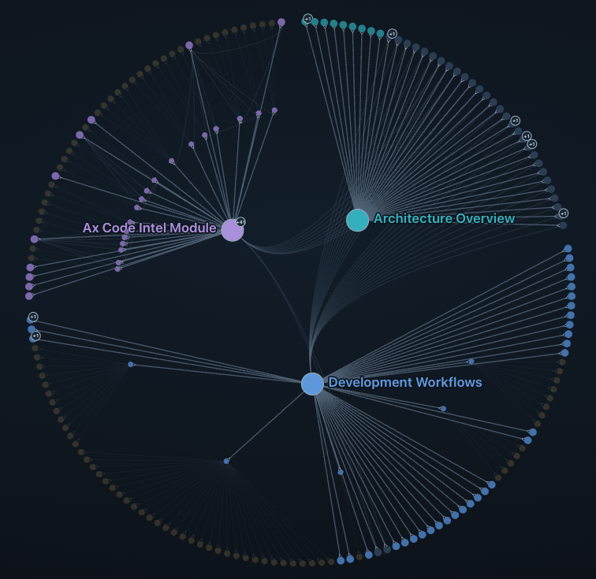
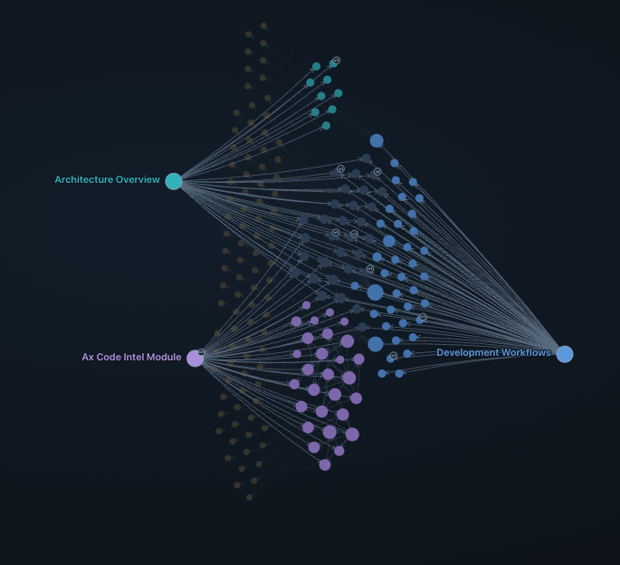
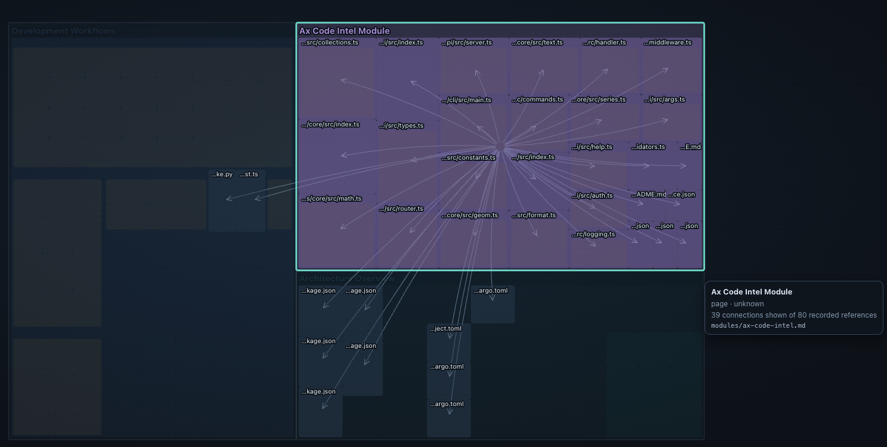

# AX Wiki Viewer

A framework-neutral, browser-safe viewer for recorded Wiki page/source evidence.
No AX Code process, framework peer dependency, CDN, or source-code reader is needed.

```ts
import { mount } from "@ax-code/ax-wiki-viewer"
const view = mount(container, graph)
view.update(nextGraph)
view.dispose()
```

Supply a schema-1 graph from `@ax-code/ax-wiki/graph`. Its validated view is bounded
to 200 nodes and 500 relationships. The graph represents Wiki membership, not code
calls. A new snapshot identity resets selection; invalid updates preserve the
previous view. Hosts can disable style injection with `{ injectStyles: false }`
and provide the exported `viewerCss` themselves.

For a self-contained offline file, Node hosts use `renderWikiGraphHtml(graph)`
from `@ax-code/ax-wiki-viewer/node`. The function returns HTML and its hash-based CSP.
The browser root does not import the Node entrypoint. Data is field-allowlisted;
relative paths and page titles can still be sensitive.

The map offers four switchable views over the same evidence: a force-directed lane
layout, a radial cluster (every file and symbol leaf on the outer ring), an arc
diagram (nodes on one line, citations above and imports below), and a nested
treemap (pages contain files, files contain symbols). The radial, arc and treemap
views derive a hierarchy from each file's first citing page and never invent
branch lengths or distances. The Explore panel is a collapsible tree over the same
hierarchy. Each view states the question it answers.

The pictures below are AX Code's own wiki in this viewer. Lines are page-to-source
citations, not calls. Arc and treemap are not shown.



**Radial.** What surrounds each page? Cited files sit on the outer ring.



**Force.** Who cites what? Files gather next to the page that cites them.



**One page, opened.** Selecting a page lights its cited files. This selection
shows 39 of 80 recorded references for `modules/ax-code-intel.md`.

An opt-in Auto-tour (off by default,
disabled under reduced motion) can cycle the views while the page is idle; any
activity restarts the idle clock, and it can be started from `mount` with
`{ tour: { enabled: true, intervalMs } }` (default 3 minutes). New views are one
entry in the view registry plus a layout factory.

Build: `pnpm build`. Check generated assets: `pnpm check:bundle`.
Run unit tests: `pnpm test`. Run browser tests after building: `pnpm test:browser`.
Set `AX_WIKI_CHROMIUM` to a Chromium executable when it is not installed at the
Playwright default location. Browser tests exercise offline CSP, hostile labels,
search/filter, keyboard navigation, mobile layout, and instance disposal.
